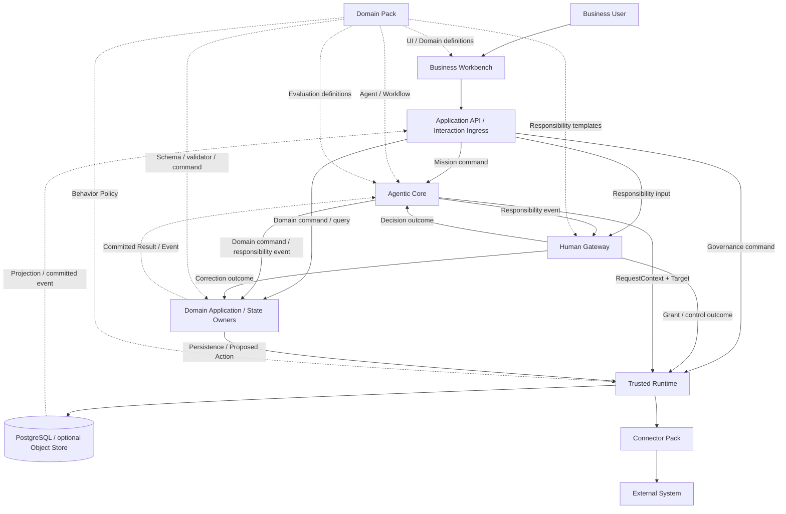
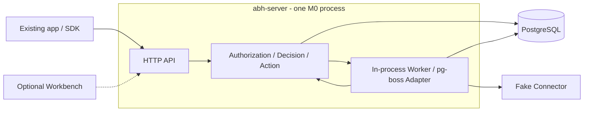
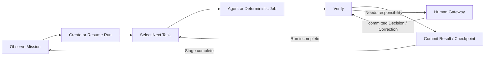
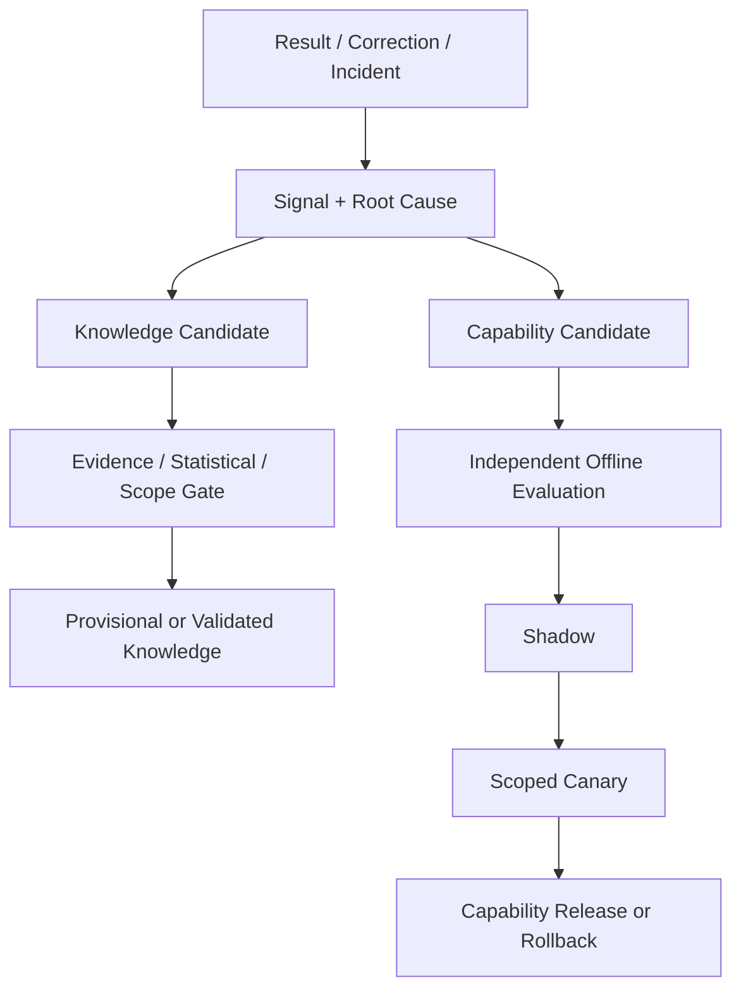

# Agentic Business Harness 总体设计

> 简称：ABH
> 规范级别：Normative Architecture and Incremental Delivery Baseline
> 版本：2.12
> 日期：2026-09-07
> 上位论证：[Building Agentic Business Harness on Agent Harness](Building-Agentic-Business-Harness-on-Agent-Harness.md)
> 首个领域实现：[Marketing Domain Pack 与 Lime Ads 总体设计](https://github.com/GoatGit/lime-ads/blob/main/docs/V1/00-%E6%80%BB%E4%BD%93%E8%AE%BE%E8%AE%A1/%E4%B8%AD%E5%9B%BD%E5%87%BA%E6%B5%B7AI%E5%B9%BF%E5%91%8A%E8%90%A5%E9%94%80%E7%B3%BB%E7%BB%9F%E6%80%BB%E4%BD%93%E8%AE%BE%E8%AE%A1.md)

## 1. 文档目的

本文定义 ABH 的产品边界、最小架构、可信执行协议、开源复用策略和渐进实施门禁。字段级 Schema、状态枚举、错误码和 SLO 必须分别由 Contract Package、状态与执行规范、通用应用契约及 NFR 文档维护唯一来源；这些下游产物未通过放行门禁前，总体设计中的示例不构成第二套机器契约。

### 1.1 一页决策摘要

| 主题 | V1 决策 |
|---|---|
| 产品形态 | 可嵌入业务产品的开源业务 Agent 运行框架，不是通用 BPM、Agent IDE 或模型平台 |
| 逻辑边界 | Agentic Core、Human Gateway、Trusted Runtime、Business Workbench 四个责任域 |
| 最小接入 | 先提交一个受控 Action，需要持续目标时再启用 Mission；普通开发者从 `@abh/core` 的公开入口开始 |
| 首期部署 | M0 为 `abh-server`（内置 Worker）+ PostgreSQL；Workbench 可选。M1 真实写入拆 `abh-worker` 并接生产身份/Secret；文件/大对象按需接 Object Store |
| Agent Runtime | 每个运行 Profile 只选一个 Agent Harness；V1 使用 Pi Agent Core，通过 `AgentRuntimePort` 隔离，同一业务链不并存第二套 Agent Loop |
| 外部写入 | 一律经过 `Proposed Action → Preflight → Authorized Action → Operation → Attempt → Receipt → Reconciliation`；Preflight 从 `RequestContext + Action Target + 上游权限引用` 开始，固定能力和两类 Policy 版本，生成 Action 专属 Authorization Snapshot |
| 事件 | 先用 PostgreSQL Transactional Outbox；达到量化阈值后再引入 Kafka/Debezium |
| 权限 | 生产使用标准 OIDC（自托管参考 Keycloak）；PostgreSQL 保存关系与 Grant；OPA-WASM 在应用进程内评估条件策略 |
| 学习 | 默认保存业务证据；按需开启 Signal 捕获与离线评测，自动发布仅在收益被证明后启用 |
| 扩展 | Domain Pack 注入行业语义，Connector Pack 隔离外部协议；两者不得绕过可信执行 |
| 实现策略 | 成熟开源优先、薄适配、自研补缺；ABH 拥有业务契约与验收责任，底层实现可随上游成熟而替换和缩减 |
| 复杂度 | 默认一个应用进程、一个正式数据库；静态注册、单路径执行和现成适配；能力声明决定加载范围，无需启动全部模块 |

### 1.2 SOTA 的可验证定义

ABH 以“在可控复杂度下，把 Agent Harness 变成可运营的业务系统”作为设计目标。行业 SOTA 不是文档中的自我声明，而是同时通过以下证据门禁：

| 维度 | 必须证明的结果 |
|---|---|
| Agentic 能力 | 有界 Loop、上下文工程、强类型 Tool、Checkpoint/恢复、Human Interrupt、评测和受治理学习形成完整闭环 |
| 业务可靠性 | 撤权、并发、超时、部分成功和进程崩溃下不越权、不重复产生副作用，Unknown 可对账收敛 |
| 人机责任 | 常规产出不依赖固定人工节点，高影响决定又能解析到有权主体并被撤回/接管 |
| 可扩展性 | 至少两个异质 Domain Pack 只通过公开 SDK/CTK 运行，Core 不出现领域特例 |
| 效率 | 在冻结负载下满足 SLO，并相对单纯 Agent Harness 基线改善单位有效结果的人工、周期和总成本 |
| 开放可验证性 | 第三方可使用公开源码、契约、CTK 和签名制品在 clean-room 环境复现声明 |

任一维度缺少运行证据时，只能声明候选架构或已验证能力，不声明 SOTA。这一约束防止为了“先进”而提前引入多 Agent、微服务或重型基础设施。

## 2. 定义、适用与非目标

ABH 复用 Agent Harness 的模型—工具循环及其已具备的上下文、恢复和协作能力，补足具体业务所需的长期目标、组织责任、真实副作用与正式事实契约。两者的实现分工随上游能力演进，以适配和契约测试确定；通用 Agent 平台可以承载 ABH 的底层能力。

```text
Agent Harness       模型 + 上下文 + 工具 → 一次受控 Agent Invocation
ABH                 Mission + 责任 + 可信执行 → 可恢复的业务闭环
Business Product    ABH + Domain Pack + Connector Pack → 行业产品
```

ABH 的价值不是“更多 Agent”，而是让 Agent 提案经过可证明的责任、授权和执行链转化为业务结果，并能在结果不确定时安全恢复。

当现有 Harness 加业务代码难以可靠处理授权、外部副作用或恢复责任时，按需接入 ABH 对应能力。长期目标、多系统协作、跨组织委托和受治理学习共同存在时，完整 ABH 的价值更明显；采用范围取决于可减少的业务与维护成本。

单轮生成、个人无副作用助手、一次性离线分析和普通 CRUD 不应引入完整 ABH。ABH V1 也不做基础模型训练平台、模型市场、通用 BPMN、低代码 Workflow 编辑器、每模块一个微服务、任意插件市场、无边界在线自我修改和对外部平台的分布式事务。

### 2.1 从一个动作开始接入

| 开发者当前需求 | 接入内容 | 首次需要理解 |
|---|---|---|
| 已有 Agent/应用，希望一次写入可审批、可查回 | 注册 Connector/Action 定义，通过公开 API 提交业务输入，取得跟踪结果；用现有界面完成必要决定 | Action、Connector、Decision |
| 希望 ABH 持续推进业务目标 | 在同一套执行能力上注册 Agent 和固定 Workflow，创建 Mission | 增加 Mission；Run/Task/Invocation 由框架管理 |

独立 Action 的 missionRef 为空；无需创建空 Mission、安装 Pi、定义 Agent 或建立学习对象。外部 Agent 通过受认证 Service 提交提案，Scope 和执行权限由 ABH 重验；ABH 只保证经其受控入口执行的动作，部署方须防止同一受管资源通过其他凭据绕过控制。

已有产品可保留登录、业务数据库和页面。通过标准身份与领域 Port 连接 ABH，ABH 的授权、账本、Action 与 Audit 使用同一 PostgreSQL 权威事务。外部业务库不进入该原子事务：输入保存版本/快照，变更执行使用前置条件与对账，不宣称跨库原子性。

首次接入无需理解四个责任域、编写全部 SDK 或自行组装 Registry。未用的 Mission、学习、跨组织路由、Workbench 与动态编排不启动对应 Worker、订阅或维护任务；已接受动作的对账和责任清理必须运行到安全完成。ABH 维护者仍须按模块规范实现这些边界。

## 3. 设计原则与复杂度预算

1. **业务目标先于对话**：Mission 是长期目标载体，对话只是入口。
2. **Agent 负责语义，程序负责事实和约束**：权限、金额、状态、时间、幂等和副作用不依赖 Prompt 自律；Transcript、Trace、缓存和向量索引不能替代正式事实。
3. **提案与执行权分离**：Agent 只能形成产物或 Proposed Action，不能批准、扩大自身权限或直接产生外部副作用。
4. **未知优于伪确定**：外部结果不明时进入可对账状态，禁止盲重试和伪报成功；所有关键结果必须可审计、可恢复。
5. **默认最小路径**：从一个受控动作、单应用执行进程和 PostgreSQL 开始；需要原生 Agent 时默认单 Agent、单 Workflow，Web 按需启用。只有证据证明收益或隔离需要时才增加并行、基础设施或 Worker/服务拆分。
6. **开源优先，最小自研**：优先采用现有依赖和成熟社区实现，通过薄适配补足业务契约；同一状态、重试、授权或发布责任只有一个 Owner。上游满足同等契约且总体成本更低时，替换并删除重复实现。
7. **按 Scope 可逆演进**：新能力必须可按 Organization、Mission 或风险 Scope 关闭、降级和回滚，并为每个新增对象或组件证明量化收益、Owner 和退出方案。

新增组件或部署单元前必须同时满足：有已观测的容量/事故证据，或即将启用能力所必需的安全、隔离和合规要求；现有组件无法通过配置、索引、批处理或隔舱解决；不产生第二 Owner；具备 SLO、升级、备份和故障手册；具备 Port、导出或迁移路径。功能和安全前置条件在能力启用前验证，容量优化按第 18.5 节的评测窗口证明。

## 4. 顶层架构

### 4.1 逻辑架构与责任



四个 ABH 子系统是代码责任域，不是四个微服务。Domain Application 由业务产品装配 Domain Pack 形成，是 ABH 之上的业务语义层，不是第五个 ABH 子系统：

| 子系统 | 唯一责任 | 不拥有 |
|---|---|---|
| Agentic Core | Mission、Run、Workflow、Agent Invocation、上下文和结果验证 | 最终授权、人类批准、Secret、外部写入 |
| Human Gateway | Goal/Authorization/Correction/Exception 的责任路由和 Decision | 日常生产、权限计算、外部执行 |
| Trusted Runtime | 身份上下文、Grant/Policy、预算、Action/Operation 可靠性、Secret、通用事实提交与 Audit | 开放式策略、创意、业务解释和领域聚合的语义/迁移决策 |
| Business Workbench | 权限裁剪的 Projection 与业务交互 | Agent 编排、权限裁决、事实写入 |
| Domain Application | 领域 Command/Query、聚合不变量、业务对象迁移与 Result/Knowledge 语义 | ABH 通用授权、Agent Loop、Action/Operation 可靠性 |
| Domain Pack | 行业对象、Agent、Workflow、Policy、评测和 UI 语义 | 可信执行与通用治理对象 |
| Connector Pack | 外部认证、能力、错误、回执和对账 | 业务目标、授权和领域对象所有权 |

### 4.2 最小部署拓扑



M0 默认仅运行 `abh-server`（同进程有界 Worker）与 PostgreSQL。复用现有页面或 SDK/HTTP 可完成受理、必要审批和结果查询；启用 Workbench 时才增加 `abh-web`。各责任模块共享数据库集群，保持明确 Schema/Repository Owner。M1 启用真实外部写入前拆出 `abh-worker`，保留控制/对账隔离；目录数量不决定服务数量。

图示首条独立 Action 模拟路径；Fake Connector 同进程运行。启用 Agent 执行能力后，在原 Worker 中通过 Pi Adapter 接入 Pi Agent 开源组件，并注入 Model Gateway，无需新常驻服务。其他条件式基础设施按第 4.4 节装配。

默认最小 Profile 使用 PostgreSQL（可选启用 pgvector）承载正式状态与 Outbox，并复用开源 `pg-boss` 承载持久 Job；ABH 只实现 `DurableExecutionPort` Adapter、业务游标与幂等边界，不自研通用队列。Temporal、Keycloak、OpenBao、SeaweedFS 与 Prometheus/Grafana 都是按能力启用的参考 Adapter/Profile，不是安装 ABH 或通过 M0 的前置条件：分别在持久编排、企业身份、真实 Secret、大对象和生产观测门禁成立时引入。模型供应商和外部平台分别通过显式 Model Adapter 和 Connector 配置接入。具体触发和退出条件以第 18.4 节为准。

### 4.3 强制依赖方向

```text
Workbench / External Ingress
  → Application Command / Query
  → ABH Domain Module
  → Port / Contract
  → Adapter
  → Open-source Runtime / External System
```

Core 不导入 Pi、Temporal、模型或供应商 SDK 类型；Domain Pack 不导入 Core Internal；Connector 不能创建 Grant、Decision 或领域目标；Web 不直连数据库、模型、Policy Engine 或外部平台；Workbench 的读写统一经 Application API/Interaction Ingress；外部写入只能通过 Action/Operation Owner；跨模块类型由 Contract Package 生成。

### 4.4 开源组件基线

V1 只把“代码/契约基线”和“当前阶段部署 Profile”称为默认，不能把某个参考 Adapter 写成所有阶段的固定服务。分类具有规范含义：**必选能力**是所有适用 Profile 都必须满足的语义或 Port；**阶段必需实现**是进入某阶段必须部署的最小实现；**条件式 Adapter/Profile**只在门禁成立后启用；**未来演进候选**在出现证据前不得进入当前依赖或部署清单，门禁成立后才转为条件式项。

| 能力 | M0 最小实现 | 参考开源 Adapter / 触发时机 | 不变边界 |
|---|---|---|---|
| 应用 | Node.js 24 LTS + TypeScript strict；`abh-server` 内置有界 Worker，`abh-web` 按需启用 | 进入 M1 真实写入时必须拆出 `abh-worker`；M1 后仅在独立伸缩、驻留或团队 Owner 门禁成立时继续拆服务 | 逻辑模块不随进程拆分改变 Owner |
| 应用基础库 | Fastify 5、postgres.js、node-pg-migrate；JSON Schema 2020-12、Ajv 8、json-schema-to-typescript | 随首个 API/持久状态实现锁定补丁与许可；均为库/构建工具，无新增常驻服务 | Route、Repository、Migration 与契约的 Owner 边界保持独立 |
| Agent Loop | Pi Agent Core：`@earendil-works/pi-agent-core@0.85.1` | 启用 Agent Invocation 才加载；独立 Action 接入不依赖模型/Harness 配置 | 只经 `AgentRuntimePort`，不得泄漏 Pi 类型 |
| 持久工作 | PostgreSQL Outbox + `pg-boss` Adapter（精确锁版） | 跨日等待/Timer/恢复图复杂度或吞吐门槛成立时整体换 Temporal Adapter | `DurableExecutionPort` 隔离；游标不拥有业务事实；禁止并行运行两套 Job Owner |
| 正式数据 | PostgreSQL 16；向量列按检索需求启用 pgvector | 首日 | 状态、Grant、Ledger、Outbox与 Audit Record/Metadata 的唯一来源 |
| Artifact | M0 只支持有界文本/元数据，不要求对象存储 | 出现文件或大对象时接 `ObjectStorePort`；自托管参考 SeaweedFS（S3 API） | PostgreSQL 保存 Owner、Hash、用途、地域和版本 |
| Web | 可选 Next.js + React + TanStack Query | 需要 ABH Workbench 时启用；已有页面可直接使用公开客户端 | 只读取 Projection、提交 Command |
| Tool 调用 | 同进程强类型 Tool Binding | 需要跨进程/第三方 Tool 互操作时接 MCP Adapter | Tool Call 始终重新进入 Tool Gateway |
| 身份 | M0 模拟闭环仅用不可进入生产的测试 Identity Adapter | 多用户或生产部署必须接标准 OIDC；自托管参考 Keycloak | IdP 只回答“是谁”，业务授权由 ABH 决定 |
| Policy | ABH 确定性校验 + 进程内 OPA-WASM | 首条安全链启用，无独立服务 | Mandatory Control Policy 与 Domain Behavior Policy 分别版本化；OPA 不拥有 Grant |
| Secret | M0 可使用本地模型，或通过仅限非生产的 `SecretBrokerPort` Adapter 提供模型凭据；无真实 Connector Secret | 接真实 Connector 前接符合生产门禁的 `SecretBrokerPort` 实现；自托管参考 OpenBao | Secret 仅短时下发给受信 Worker；开发 Adapter 在生产 Profile 必须启动失败 |
| 观测 | OpenTelemetry SDK + 结构化 stdout | 生产 SLO 需要采集时启 Prometheus/Grafana Profile | 不替代 Audit，不参与业务成功判定 |
| 回归评测 | 领域测试；首个 Prompt 变更起运行 promptfoo | CI 工具，不是常驻生产服务 | 结果不能自行批准发布 |

Temporal、MCP Server、Keycloak、OpenBao、SeaweedFS 和 Prometheus/Grafana 是条件式 Adapter/运行 Profile；Valkey、Kafka/Debezium、OpenFGA、OPA Server、SPIRE、Loki、Tempo、Langfuse、MLflow、dbt、OpenFeature 是未来演进候选。两组都只有达到第 18.4 节门禁才进入相应阶段的部署清单，后一组在此之前不得成为当前 Profile 依赖。能力与具名产品分别判定：M1 的生产 OIDC、`SecretBrokerPort` 实现、可验证 SLO 证据和独立 `abh-worker` 是阶段必需项；Keycloak、OpenBao、Prometheus/Grafana 仅在无法复用合规现有实现时启用，SLO 证据也可由已配置的现有 OTLP 后端产生。V1 不并行引入 LangGraph、OpenAI Agents SDK、CrewAI、Dapr、Flowable 或第二套管理后台框架。

### 4.5 ABH 自研边界

ABH 拥有语义和验收责任，不意味着对应模块必须全部自行实现。默认选择顺序为：现有依赖的配置/公开扩展 → 满足要求的成熟开源组件 → 可合入上游的通用改进 → ABH 必需的最小补缺。选择以业务闭环所需能力为边界，不为框架完整性重建通用 Agent 平台。

| 责任模块 | ABH 保留的业务契约与必要集成 | 优先复用的实现 |
|---|---|---|
| Mission and Run | 业务目标、Task 提交、版本、停止条件与恢复证据 | Pi Loop/运行钩子、pg-boss 调度；上下文转换和通用工具循环沿用上游 |
| Responsibility and Decision | 组织责任、决定版本、条件汇总和生效关联 | 标准 OIDC、JSON Forms 与既有 UI 组件 |
| Control and Resources | Grant、Policy 求交、资源占用/负债、撤权与 Tool Binding | OPA-WASM、PostgreSQL 事务/约束、生产身份与 Secret Adapter |
| Action & Operation | 业务意图、计划授权、幂等、Unknown 与对账契约 | 队列投递、官方/成熟平台 SDK 与协议库；补足平台特有最终性判定 |
| Projection | 权限裁剪、业务结果视图、可用动作和新鲜度 | Next.js、React、TanStack Query、ECharts |
| Evidence and Learning | 证据归因、领域知识提交、独立 Gate 与受控发布 | promptfoo、测试 Runner、OpenTelemetry；领域算法和统计计算优先采用经验证库 |

**复用准入。** 组件须满足用途和许可证、自托管/离线要求、公开扩展点、维护与安全修复能力，并通过对应 CTK。比较集成、运行、升级、安全修补和退出的总成本；流行度、功能数量和开源标签不代替契约验证。优先使用已有组件的能力，不因存在开源方案就增加常驻服务。

**薄适配。** Adapter 负责协议转换、身份/用途注入、错误归一与证据关联；业务规则仍由唯一 Owner 提交。既有组件已负责的 Loop、调度、重试或存储只保留一份实现。包装若开始复制上游内部机制，应先重审组件适配性；第三方 SDK 类型仅在真正需要替换或治理的边界隔离，不为所有库新建抽象层。

**最小补缺与社区贡献。** 自研项须能指出公开实现缺少的具体契约、适用范围、验收方法及删除条件。可通用的问题优先提交上游 Issue/PR；上游尚未接受时可维护有界、隔离的临时补丁，登记责任人与复核版本，不把等待上游作为阻塞必要交付的理由。长期 fork 必须证明公开扩展、替代组件和薄适配均不足，并承担独立升级/安全成本。

**随上游缩减。** 组件升级或每个工程批次验收时，复核已补缺机制是否仍有必要；上游在安全、恢复和数据控制上等价且总成本更优时，通过既有 Port/CTK 迁移并移除旧实现。保留业务契约和历史可解释性，不保留重复状态或执行 Owner。模型、Harness、技能/插件生态与托管平台都是可利用的上游；官方开源发行仍保持可独立运行，商业服务只作为显式可选适配。

### 4.6 关键路径与性能边界

| 路径 | 同步部分 | 异步部分 | 保护策略 |
|---|---|---|---|
| 业务 Command | 身份、Scope、OPA-WASM、版本冲突检查；一次 PostgreSQL 事务 | Outbox 投递、Run 唤醒、Projection 更新 | 不在请求线程调用模型或外部平台 |
| Agent Invocation | 读取固定 Context Snapshot、生成受限 Tool Binding | Pi Loop、模型流、验证和 Checkpoint | 每次 Invocation 有墙钟、Token、Turn、Tool 和候选上限 |
| 外部写入 | Action Preflight、Grant/Policy/限额/Commitment 重验 | Operation、Receipt、Reconciliation、补偿 | 按 Connection 隔舱；Unknown 禁止盲重试 |
| 业务读取 | 读取权限裁剪 Projection | 数据回补和索引更新 | Projection 带 `asOf`/水位线；过期数据显式降级 |

默认请求路径只经过一次应用内授权解析和一次事实事务；需要等待、模型或 Provider 的工作全部异步化。只有压测证明 PostgreSQL、进程内缓存或批处理无法满足 NFR 时，才引入额外缓存、消息系统或服务拆分。

### 4.7 默认装配与配置边界

常用接入只直接依赖 `@abh/core`：根入口提供业务声明，`@abh/core/client` 提供不带 Node/Worker 依赖的类型化 HTTP 客户端；专业 SDK 供编写复杂扩展时按需使用。默认实现由 server/CLI 装配入口加载，Core 内部仍只依赖 Port。声明和客户端复用既有 Command/Schema，不增加第二业务层。

开发者维护业务输入/输出 Schema、动作或 Agent 定义、必要审批和资源上限；SDK/构建工具生成标准 Workflow 模板、Manifest、精确版本引用及静态基线分配。单组织且策略无额外职责分离要求时，审批使用单个责任席位，运行时生成 Request/Decision；Snapshot、Permit、Operation、Receipt 由框架创建。单组织不创建占位 Workspace，未启用学习不创建 Candidate/评测队列；版本与权限记录仍按需持久化。

默认组件由发行版装配，业务作者无需实现 Agent/Model/Durable/Identity/Secret 等全部 Port。生产的身份、用途、权限、凭据和花费上限必须显式绑定；模板只生成有限开发配置，不能把便捷默认转化为生产授权。没有业务需要时不编写自定义 Rego、动态 Graph Patch 或发布策略。

## 5. 扩展模型

ABH 的公开扩展面只有四类，其中 Domain Pack 和 Connector Pack 是业务装配单元，Runtime Adapter 和 Workbench Extension 是技术/体验替换点：

| 扩展类型 | 可以提供 | 不得成为 |
|---|---|---|
| Domain Pack | 领域对象、Agent/Workflow Definition、Domain Behavior Policy、Evaluation、Projection 和责任模板 | Core 状态、Grant/Decision/Action 的第二 Owner |
| Connector Pack | 外部系统 Capability、认证映射、请求/错误归一和对账观察 | 业务目标、授权、正式 Receipt 或领域对象 Owner |
| Runtime Adapter | `AgentRuntimePort`、`DurableExecutionPort`、Identity/Secret/Object/Model 等 Port 实现 | 泄漏供应商类型或改变 Port 语义的旁路 |
| Workbench Extension | 声明式 View、字段组件和已注册 Command 入口 | 直连数据库、模型、Policy Engine 或外部系统的前端插件 |

Domain Pack 是版本化行业能力包，Manifest 使用 `metadata.id/version`、`compatibility.abh`，以及 Schema、Agent、Workflow、Domain Behavior Policy、Evaluation、Projection、所需 Capability 和 Migration 引用，完整字段以[Pack 运行规范](ABH公共内核与Pack运行规范.md#4-pack-manifest)为准。它可以定义领域语义，但不得直调模型/外部系统 SDK、写 ABH 内部表、复制 Decision/Grant/Action 等通用对象，或绕过 Tool Gateway 与 Action Engine。

Connector Pack 声明能力而不是暴露供应商 SDK。每项写能力至少声明 Scope、风险、幂等、Dry-run、批量限制、限流、回执、查询、补偿和数据驻留。Connector 负责认证适配、请求映射、错误归一，以及采集并归一化 Receipt/Reconciliation 输入；Operation Controller 校验后提交正式记录与状态迁移。Connector 不负责目标、授权、正式 Receipt 状态或领域对象所有权。

生产加载 Pack 前验证来源、内容摘要、兼容范围、权限声明和迁移计划。Pack 按 Declarative、TrustedCode、Isolated 三种信任模式执行：第三方 Domain Pack 默认仅声明式，同进程代码必须被部署方明确视为受信代码，未受信可执行能力只经隔离 Port 运行。签名证明来源，CTK 证明契约符合，两者都不替代安全审计。完整 Manifest、Pack Loader、资源/出站权限和测试见[ABH 公共内核与 Pack 运行规范](ABH公共内核与Pack运行规范.md)。首期使用静态配置与构建期注册，不建设动态插件市场。

## 6. Agentic Core

### 6.1 最小运行模型

```text
Mission 1 ── N Run 1 ── N Task
Task ── 0..N Agent Invocation / Deterministic Job
Run ── 0..N Proposed Action / Decision Request / Result
```

Mission 保存长期目标、约束、成功/停止条件和资源边界；Run 保存一次可恢复推进的固定启动快照；Task 是 Run 内节点；Agent Definition 表达稳定责任，Invocation 表达一次带预算的执行。字段与状态进入实现前必须由机器《状态与执行契约规范》和 Contract Package 固化为唯一来源；总体设计只定义关系与不变量。

### 6.2 双层控制循环



Mission Controller 是 Mission 生命周期的唯一 Owner，并独占发起 Run 创建/唤醒的资格；它只依据已提交 Trigger、版本化停止/唤醒条件、有效 Decision 或通过 Domain Owner 校验的 Command 作出生命周期决定。Run Orchestrator 接收带 Mission 版本和 Trigger 去重键的 Command，唯一提交 Run 创建、启动快照及后续状态；两者通过同一应用事务或 Outbox/Inbox 协作，不共享 Run 写权。Agent 只提出 Task Graph Patch，Run Orchestrator 验证后提交。默认使用预定义有界 Workflow；动态图受节点数、深度、并发和预算限制。

Run 只由已提交的 Trigger 创建或唤醒。V1 Trigger 限于定时器、领域事件、外部事件归一化结果、Result/阈值变化、人类 Decision/Correction 和显式用户 Command；每个 Trigger 携带去重键、来源水位、目标 Mission 与版本前置条件。原始 Webhook、模型输出或未提交 Tool Result 不能直接唤醒 Run。

每个 Run/Invocation 至少限制墙钟时间、模型费用、Turn、Tool 调用、并发和候选数。预算耗尽、连续无进展、证据不足、对象版本冲突、权限变化或风险升高时必须停止、暂停或重新规划。

`AgentRuntimePort` 只定义 invoke、continue、cancel、inspect 和稳定事件映射。需要模型—工具循环的路径为 `AgentRuntimePort → Pi Adapter → ModelInvocationPort → Model Gateway`；分类、抽取、摘要等固定无工具任务使用 `Structured Model Job → ModelInvocationPort → Model Gateway`。“Structured”表示调度、输入输出 Schema、预算和验证是确定的，不表示模型输出具有确定性。Model Gateway 统一强制模型允许列表、Purpose/Data-use、数据分类与驻留、供应商训练/保留条件、成本预算、安全裁剪、Secret 和 Audit；路由无法满足任一数据约束时 fail closed，不以较弱模型策略静默降级。业务代码、Agent 和 Domain Pack 不得直调模型供应商。

### 6.3 Agent Invocation 主链

```text
Committed trigger
  → freeze Run/Task/Capability versions
  → prepare Created Invocation identity and immutable TaskSpec
  → resolve task-scoped AuthorizedRequestContext
  → build immutable Context Manifest
  → issue least-privilege Tool Binding
  → finalize immutable AgentTaskContract and mark Invocation Running
  → invoke the selected Agent Harness
  → validate structured output and cited evidence
  → submit Domain Command / Proposed Action / Responsibility Event
  → commit Checkpoint and past-tense Event
```

`AgentTaskContract` 是一次 Invocation 的唯一跨模块输入，固定目标、验收、输入版本、上下文、工具、模型策略、预算、Deadline 和停止条件。其 `AuthorizedRequestContext` 只授权当前任务和可见 Tool；后续 Proposed Action 只携带该上游快照作为来源证据，必须为具体 Action 重新执行 Preflight，不继承上游执行权。Invocation 启动后不热改 Contract；源对象、权限或能力版本失效时取消/停止当前运行，由 Owner 基于新快照创建新 Invocation。

Agent Runtime 返回结构化产物、候选对象、Task Graph Patch、Decision Request 或 Proposed Action 的引用及明确 Stop Reason。Invocation 的 `Completed` 只表示 Harness 正常返回；Run Orchestrator 还须取得 Verification Pass 和必要的正式提交回执，才能将 Task 记为成功。业务批准、Action 结果与 Knowledge 晋级分别由其 Owner 判断。

### 6.4 Context 工程与 Memory 边界

Context Builder 按固定优先级组装最小上下文：硬约束和输出 Schema、当前任务与对象版本、经确认事实/Knowledge、必要 Evidence，最后才是临时 Memory 和候选材料。每个 Context Section 保留来源、版本、观测时间、数据分类、Purpose、可信级别和引用 Key；最终 Context Manifest 内容寻址且对本次 Invocation 不可变。

Mission Memory 保存当前目标的短中期工作状态；Domain Pack 定义领域长期 Memory；Knowledge 保存经证据门禁的可失效主张。它们以来源引用支持 Context，不覆盖正式事实。向量索引和摘要可由保留的来源重建；Transcript 和 Trace 是原始运行记录，丢失后不能假定能够精确再现，隐藏推理也不作为必需 Evidence。恢复所需的输入、输出引用与 Checkpoint 必须按保留策略持久化。压缩必须保留数字、日期、否定条件、风险边界和引用；超出 Token 预算且不能安全压缩时返回 Context Gap。

检索文档、Tool 结果和外部内容始终作为带来源的不可信数据区，其中指令不能覆盖 System/Task Contract 或授权。语义检索只返回候选 Ref，Builder 向权威 Store 批量回源并重验 Tenant、Purpose、版本、删除和时效。

### 6.5 Tool 与副作用边界

Tool 以能力而非 SDK 函数暴露。Tool Binding Factory 根据 Created Invocation 的固定 TaskSpec 与 AuthorizedRequestContext 登记最小可见集；完整 AgentTaskContract 引用这些 Binding，Invocation Running 后才可使用。Binding 固定 Scope、Purpose、输入/输出 Schema、调用次数、Deadline 和副作用级别。每次调用重入 Tool Gateway，不因 Tool 已对 Agent 可见就跳过实时授权。

| Tool 类型 | 允许结果 | 硬边界 |
|---|---|---|
| Read | 带水位、来源和裁剪的数据 | 只在当前 Tenant/Purpose/Scope 查询 |
| Compute | 可重现计算或验证 Artifact | 不写正式业务对象 |
| Propose | 候选对象、Decision Request 或 Proposed Action | 仍由对应 Owner 验证和提交 |
| Side-effect dispatch | 只返回已存在 Action/Operation 的跟踪结果 | 只由 Trusted Runtime Worker 使用，不直接暴露给 Agent |

同进程强类型 Binding 是默认路径；MCP 只作为跨进程或第三方互操传输。两者使用同一 Tool Schema、Binding、Gateway、Audit 和 Action 边界，不建第二套权限语义。

### 6.6 多 Agent 协作的最小模型

一个 Run Scope 同一时刻只有一个持有有效租约的逻辑协调者。Domain Pack 声明稳定 Agent Definition 和可委托关系，但默认先使用单 Agent/单路径完成任务。只在预注册评测证明专业拆分提高质量或风险发现，且成本、尾延迟和失败率不越界时，才按 Scope 启用额外实例。

委托使用完整 `AgentTaskContract`，不转发全量 Transcript 或上游身份。并行分支共享同一只读事实基线、使用隔离工作状态，最终通过显式 Merge Proposal、支持/反对 Evidence、版本前置条件和验证器收敛。多数投票、隐式 handoff 和模型间共识不构成事实、授权或发布依据。

### 6.7 验证、中断与恢复

输出按 Schema → 来源/版本 → 确定性业务规则 → 领域质量 → 风险的顺序验证。Agent Evaluator 可作为专业信号，但高影响结论不能仅由产生该产物的 Agent 自评；金额、权限、状态、统计和副作用由确定性 Engine 或有权人类裁决。

Checkpoint 只保存已验证输出 Ref、未完成等待、预算、版本和因果水位。恢复时复用已提交产物，重读授权与外部事实，对已可能产生副作用的工作只查询 Action/Operation 并对账。取消从 Run 传播到 Invocation、可取消 Job 和未 Dispatch Operation；已 Dispatch 的外部操作转入对账，不伪装成已撤销。

### 6.8 主流 Agent 系统能力对齐

| 主流 Harness 能力 | ABH 唯一 Owner/契约 | V1 最小实现 | 复杂度门禁 |
|---|---|---|---|
| Model—Tool Loop | `AgentRuntimePort` | 单 Pi Adapter | 同一业务链禁止第二 Loop |
| Context engineering | Context Builder + immutable Manifest | 版本 Ref、信任分层、Token 预算、引用 | 证据足够后才引入外部检索服务 |
| Typed tools | Tool Binding Factory + Tool Gateway | 同进程 Binding | 跨进程/第三方互操才启用 MCP |
| Durable execution | Run Orchestrator + `DurableExecutionPort` | PostgreSQL + `pg-boss` | 复杂等待/恢复图证据成立后整体换 Temporal |
| Interrupt/resume | Run 等待状态 + Responsibility Event | 持久等待与重验 | 不把 Human Gateway 扩展为通用人工任务流 |
| Multi-agent | Typed delegation + single logical coordinator | 默认单 Agent | 只按质量/风险增益逐项开启 |
| Evaluation | Verification + Evaluation Suite | Schema/确定性检查 + 离线评测 | 自动发布要求 Shadow/Canary/回滚证据 |
| Memory/learning | Memory、Knowledge、Learning Signal/Release | 先捕获证据 | 不允许无门禁在线自修改 |
| Streaming/observability | stable Agent Event mapping + OTEL | 裁剪事件、Trace/Metric/Log | 不把 Token Delta/hidden reasoning 当成 Audit 或业务事实 |

该表是 Agentic Core 的最小完整性清单，不是要将每行拆成服务。任一能力可以使用不同 Adapter，但 Owner、公开契约和安全不变量不随实现切换而改变。

## 7. Human Gateway

Human Gateway 只处理 Goal、Authorization、Correction、Exception 四类正式责任。普通编辑、查看和低风险委托直接走业务 Command，不进入审批队列。

```text
Responsibility Event
  → Organization + Scope + Responsibility Type 解析责任人
  → 展示问题、对象版本、选项、影响与证据
  → 记录 Decision
  → 发布 Decision Outcome
  → 对应 Owner 处理结果：Control 生成/引用 Grant，Domain Owner 修改业务对象，Takeover Coordinator 启用接管
```

没有合法责任人时保持 Unresolved 并阻断动作，禁止回退到任意管理员。Human Gateway 拥有责任路由与 Decision；Control 拥有 Grant 与有效权限解析；各 Domain Owner 拥有被纠正的业务对象。人工接管沿用同一授权、Action 和 Audit 契约。首期只实现静态 Assignment、显式 Delegation、到期升级和四类责任表单。

## 8. Trusted Runtime

### 8.1 可信执行链

```mermaid
flowchart LR
    P[Business effect proposal] --> A0[Action: Proposed]
    A0 --> R[RequestContext + Action Target<br/>+ upstream authority refs]
    R --> C[Preflight preparation]
    C --> V[Persist complete capability pin set<br/>+ load current Mandatory Policy]
    V --> PL[Compile and validate immutable Operation Plan]
    PL --> X[Resolve responsibility and authority]
    X -->|new human responsibility required| D[Decision]
    D --> G[Service Grant / Authority]
    X -->|existing valid authority| B[Evaluate Grant / effective Policy / limits / version<br/>reserve resources and create Action Snapshot]
    G --> B
    B --> A1[Action: Authorized]
    A1 --> O[Operation]
    O --> T[Attempt]
    T --> E[External System]
    E --> RC[Receipt / Observation]
    RC --> Q[Reconciliation]
    Q --> RES[Result / Exception]
```



Action Engine 先以业务幂等键保存 Proposed Action，经领域验证固定业务意图后进入授权流程；这一步不产生外部效果。V1 以同一 PostgreSQL 原子事务保存 Authorization Snapshot、Policy Evaluation Record、全部适用 Resource Reservation/Commitment 和 Authorized 状态。任一预留失败全部回滚。状态与 Outcome 由[状态规范](../10-ABH详细设计/02-状态与执行契约规范.md)定义，事务与撤权竞争以[授权执行链](../10-ABH详细设计/03-责任授权与执行链规范.md)为唯一实现规范。

Action Preflight 先以服务端签发的 `RequestContext`、Action Target/对象语义版本和正式来源完成无副作用准备，再以完整执行 Authority/Decision/Grant 进入原子授权。独立 Action 使用合法 Service 与 Control 管理的 ExecutionAuthority，Mission 动作关联 MissionAuthority/Invocation；首次待批提案可以尚无执行 Authority，批准后按 [Control 合同](../10-ABH详细设计/21-Authorization与Policy详细设计.md#21-独立-action-的-executionauthority)签发。上游 Authorization Snapshot 只证明提案来源，不能作为该 Action 的授权结果。顺序是可编码不可交换的：

```text
RequestContext + Action Target + source command / preparation authority refs
  → resolve or revalidate exactly one applicable Capability Assignment
  → persist complete behavior pin set and load current Mandatory Policy
  → compile and register nonempty Operation Plan without side effects
  → resolve existing execution Authority or await complete Decision Effect
  → evaluate identity / responsibility / Grant / Purpose / effective Policy / limits / object version
  → reserve applicable resources
  → create Action-specific Authorization Snapshot
  → issue AuthorizedRequestContext
```

Capability Assignment 的每个生产行为槽位只能解析出一个 Active 或 Canary 分配规则，优先级固定为 `Mission/Object/Task → Workspace → Organization → Domain default`。同一优先级出现多个有效规则时 fail closed，不按创建时间或发现顺序猜测。Canary 规则同时声明基线/候选版本和分配单元，以 `releaseExperimentId + allocationUnitRef` 的稳定哈希分桶并持久分配结果，避免重启、扩容或任务重试改变分组。Shadow 不参与生产选择，仅在隔离评测命名空间运行，生产写入在 Gateway/Owner 硬拒绝。Capability Release 只固定已评测行为资产，不授予 Grant、不扩大 Scope。

版本选择只在 Run 启动或无来源 Run 的 Action 首次 Preflight 时发生；Release Owner 以 Run/Action 为主体持久保存完整 pinSet，字段/事务/恢复见 [Release 固定协议](../10-ABH详细设计/30-Capability-Release详细设计.md#41-run-与独立-action-的固定协议)。来源 Run 的 Action 继承原集合；独立 Action 在编译 Plan 前固定自身所需执行版本，不创建占位 Run 或 Agent 版本。常规分配更新只影响尚未固定的新主体，恢复与重授权查回原 pinSet；紧急撤回冻结新 Invocation/Dispatch，已 Dispatch Operation 保留原版本用于查回。新运行只有在兼容性、用途和当前强制策略均允许时才回滚到旧版本。初始静态配置也生成一个不可变基线 Release/Assignment 记录，但无需自动候选、分桶或在线学习服务。

同一 Policy Engine 执行两类权威和发布链独立的策略，不增加第二个裁决服务：

| Policy 类型 | 责任与发布 | 可否进入 Capability Release |
|---|---|---|
| Mandatory Control Policy | Trusted Runtime Control 独立管理身份、租户、Purpose、职责分离、硬限额、禁止动作和紧急停止；变更按安全策略发布并审计 | 否；对所有能力版本强制生效 |
| Domain Behavior Policy | Domain Pack 定义建议、质量门槛、责任路由和可加严的领域风险规则 | 是；但不得覆盖 Mandatory Deny、减少强制 Obligation 或扩大 Grant |

`Effective Policy = Mandatory Control Policy ∩ Assigned Domain Behavior Policy`：Allow 需两者均允许，Obligation 合并执行，任何冲突、版本缺失或评估失败都 fail closed。没有领域附加限制的槽位使用显式的空限制版本。Authorization Snapshot 同时保存 Mandatory/Behavior Policy 版本、输入摘要和结果。已批准的预算、品牌事实、数据用途和必需责任链均作为 Owner 管理的约束输入，行为版本只能在其内工作；涉及受监管或其他强制规则的变更走治理发布，不因规则写在 Domain Pack 中就允许在线放宽。高风险 Behavior Policy/Workflow 发布需要的人类决定在发布前完成，不与某个 Action 的业务授权混合。

Authorized Action 只能基于该 Action 专属 Snapshot 签发的 `AuthorizedRequestContext` 执行。Operation Dispatch 前重验 Actor/Service Principal、组织、Scope、Purpose、Epoch、Authority 及其源 Grant、对象语义版本、当前 Mandatory Control Policy、已分配 Behavior Policy、限额和时效，并确认固定分配的执行资格未暂停或撤回。已有 Run/Action 按原 pinSet 重验，紧急撤回立即阻断新派发。在途请求仍需查回，数据库许可提交与外部 HTTP 不能原子化，具体以授权执行链的 Dispatch Permit 协议处理。任何变化使快照不再有效时，保留历史快照并重新授权或创建新 Action。

| 对象 | 目的 | 唯一 Owner |
|---|---|---|
| Decision | 有权主体对明确对象版本作出的决定 | Human Gateway |
| Grant | 对 Actor、Scope、动作、额度和期限的授权 | Control |
| MissionAuthority / ExecutionAuthority | 绑定既有 Grant 的长期委托；分别用于 Mission 和独立 Action/后台任务，不复制权限或预算 | Control |
| Capability Assignment / Release | 对指定 Scope 选择经评测的精确行为版本与 Domain Behavior Policy | Capability Release Controller |
| Mandatory Control Policy | 对所有能力版本强制生效的安全和权限控制 | Trusted Runtime Control Policy Owner |
| Authorization Snapshot | 对某次请求的身份、责任、Grant、Capability Release、两类 Policy Evaluation、Scope、Purpose、Epoch 与对象版本解析结果 | Authorization Resolver |
| Resource Reservation / Commitment | 一次性资源占用与持续负债的可结算记录 | 对应 Ledger Owner；领域包定义具体类型 |
| Action | 领域级副作用意图 | Action Engine |
| Operation Plan / Operation | 将 Validated Action 编译为面向单一 Connection/资源边界的不可变执行计划；授权绑定该计划后才能派发 | Operation Controller |
| Attempt | 一次具体外部调用尝试 | Operation Controller |
| Receipt | 外部返回或主动观察到的证据；Connector 负责采集与归一化 | Operation Controller |
| Reconciliation Record | 外部观察与预期状态的可重现比较和收敛建议 | Reconciliation Service；Operation/Action 状态仍分别由各自 Controller/Engine 提交 |
| Result | 对目标或 Action 结果的版本化解释 | Domain Owner |
| Mission Memory | 仅服务当前 Mission 的可失效工作状态 | Agentic Core Memory Owner |
| Domain/Customer Memory | 领域与客户 Scope 内的长期上下文 | Domain Memory Owner |
| Knowledge / Knowledge Candidate | 带证据、Scope、TTL 和冲突的领域主张及其候选 | Domain Knowledge Owner |
| Learning Signal / Case / Capability Candidate | 生产证据、根因和待评测系统能力改变 | Evaluation & Learning |

领域 Agent 和 Domain Owner 提供目标资源、依赖、完成策略和补偿意图；Action Engine 拥有父 Action 及其结果汇总规则；Operation Controller 在 Action Validated 后按固定 Connector Capability 无副作用地生成唯一不可变 Operation Plan，并拥有 Operation/Attempt/Receipt。Preflight 验证非空计划及每个子操作的资源、Payload、费用和影响，将 planDigest 与资源预留共同绑定到授权；Worker 只派发获准计划。需要新增影响时回到新提案/授权，不能以技术拆分扩大许可。

一个 Action 可覆盖多个 Connection，但每个 Operation 限定单一 Connection/账户/资源边界，按显式依赖调度。父 Action 只有在全部必需 Operation 查回成功时才能成功；任何子项 Unknown 都保留未决状态，阻断依赖它的写入。子项确定失败后按已批准完成策略停止剩余步骤，汇总失败或部分成功；补偿动作另行授权且引用具体 Operation。D2 必须为这些聚合规则生成穷尽的状态组合测试。

状态由机器 Contract Package 维护。外部调用超时或断开时保留显式 Unknown Outcome，通过可查询标签、Receipt 和 Reconciliation 查回；禁止把“未收到响应”当成失败后直接重发。Error Registry 描述失败原因与处置，Unknown 描述外部效果尚未证实，两者是正交维度。

### 8.2 一致性与数据

- PostgreSQL 事务提交业务对象与 Outbox；
- Command 使用幂等键和必要的 `expectedVersion`；
- Worker 通过唯一约束、Lease/Fencing 和 Inbox 防重；
- Action 幂等键标识领域意图；Operation 键由 `actionId + planItem + connection/resource boundary` 稳定派生；重试 Attempt 复用同一 Provider 幂等键，不因次数生成新键；
- 外部写入优先使用 Provider 原生幂等键。缺失原生幂等时，Connector 必须声明可查询的稳定外部标记或唯一性规则，执行“意图先落库 → 可靠时查前写 → 单次写入 → 写后查/对账绑定外部 ID”；
- 超时或断线后先按外部 ID/稳定标记查回。匹配为零且 Connector 能证明重试安全时才创建新 Attempt；多个匹配进入 Duplicate Exception 并冻结后续写入；
- Provider 既无原生幂等，又无可靠查询标记/唯一规则时，该 Capability 不得自动执行不可逆或高影响创建动作；
- 补偿是引用具体原 Operation 的新可审计 Action，不改写历史；
- Cache、Index 和 Projection 可由正式事实重建；Transcript、Trace 与 Durable Workflow History 按恢复和诊断需要保留，不能把原始运行记录的丢失当成普通缓存失效。Durable Adapter 必须提供与业务 Checkpoint 配套的恢复方案。

PostgreSQL 是内部正式事实源；外部平台是其对象状态的最终事实源；ABH 保存经对账的版本化副本。M0 的有界文本/元数据 Artifact 可直接保存在 PostgreSQL；文件或大对象门禁成立后，Artifact 正文经 `ObjectStorePort` 进入对象存储，数据库只保存引用、Hash、Owner、用途、地域和保留策略。Secret Material 不进入业务正文、模型上下文、前端或普通日志。

Data Plane 拥有通用事务、隔离、版本、保留和血缘机制，但不拥有所有业务对象的语义。Mission Controller、Human Gateway、Action Engine、Operation Controller 与各 Domain Service 仍是各自对象迁移的唯一 Owner；Data Plane 只接受通过该 Owner 不变量的事务写入。

## 9. Business Workbench

Workbench 默认呈现目标、结果、风险和待处理事项；运行图、Trace 和 Policy 细节只向工程/审计角色披露。

Projection 至少包含 `subjectRef`、`asOf/watermark/stale`、裁剪数据和 `availableActions`。`availableActions` 只是体验提示，提交时仍需服务端重新授权。页面如实展示部分成功、未知和过期数据。

产品终态覆盖目标、进展、结果、风险、待办、授权、纠错和组织治理；工程首条纵向切片先实现 Mission 进展、Decision/Exception 待办、Action/Result 状态三个任务面，不建设可视化 Workflow 编辑器或 Agent 调试主界面。

## 10. 跨层契约

所有 Command、Query、Event、Job 和 Tool Request 使用同一套可信字段，但按授权阶段分成两个不可混用的 Envelope：

- `RequestContext`：可信入口在认证、组织/Workspace、Purpose、Schema 和 Epoch 校验后签发；表明“谁正在请求什么”，尚不表明某个 Task、Tool 或 Action 已被授权。
- `AuthorizedRequestContext`：Authorization Resolver 针对明确 Target/对象版本完成 Preflight 后，引用专属 Authorization Snapshot 签发；只对快照中的主体、Scope、Purpose、能力、动作和时效有效。

两者共用请求/因果/Trace 标识、Acting 与 Resource Organization、Workspace、Actor/Invocation、Purpose、认证强度、Session/Scope Epoch、时区和过期时间，字段只在 Contract Package 定义一次。`authorizationSnapshotId` 只在 `AuthorizedRequestContext` 必填。客户端、模型、Pack 和 Connector 不能覆盖服务端可信字段。

长周期 Mission 通过版本化 `MissionAuthorityRef` 引用已存在的 Grant、Scope、Purpose、自主上限、额度和停止条件。每次持久唤醒由服务主体获得新 `RequestContext`，Authorization Resolver 再针对当前 Task/Tool 目标重验并签发短期 `AuthorizedRequestContext`；它保留原始因果，但不冒用原人类 Session。后续 Action 仍须用 Action Target 独立 Preflight。Scheduler、Agent 和 Connector 不得续期授权；Scope/Purpose 扩大、Grant 失效、额度不足或停止条件命中时进入安全等待或 Human Gateway。

独立 Action 通过 ExecutionAuthority 绑定具体 Service、允许提案人、Scope/单一 Action、用途、资源上界和有限期限；其源 Grant 与撤权 fence 始终实时有效。公共 AuthorityRef 覆盖这两类委托；Action 在 Proposed/Validated 可等待完整批准，只有有效执行委托、pinSet、Plan 与预留一并成立才可 Authorized。

- Command：幂等键、Target、必要 `expectedVersion`、Payload；
- Event：只传播已提交事实，含 Aggregate Version 与因果链；
- Job：携带不可伪造的 Context Snapshot/Ref；
- Port：声明 Caller、Implementer、超时、取消、幂等、一致性和错误分类。

机器来源必须由下游《通用应用契约与错误模型》及《Contract Package 设计》共同生成。公开 Schema、Event、CLI 和 SDK 遵循 SemVer；运行中的 Mission 固定已解析版本；破坏性变更必须有迁移、Workflow Replay、回滚和兼容测试。上述下游产物的放行要求见[模块详细设计规范第 13 章](模块详细设计规范.md#13-下游工程规范与实现放行)。

## 11. Learning Plane：证据驱动的渐进学习

Learning Plane 是跨四个子系统的协议，不是第五个服务，也不再引入一套独立成熟度编号。实现只按三个递进能力验收：

| 能力 | 启用条件 | 默认边界 |
|---|---|---|
| Evidence Capture | 首条闭环由原 Owner 保存结果、纠错、事故与版本证据；组织显式启用学习后才生成 Signal | 未启用时无学习订阅/队列；来源仍按业务用途和保留规则管理 |
| Candidate & Offline Evaluation | 已有足够且数据用途合法的稳定信号 | 只聚类、归因、提出候选并离线评测 |
| Governed Release | 离线门禁稳定且 Shadow/Canary 的线上增益可测 | 只在证据支持的最小 Scope 发布，可自动暂停和回滚 |

知识学习与能力学习分开：前者形成可引用的业务主张，后者改变 Prompt、Workflow、Tool、Domain Behavior Policy 或 Model Route。Mandatory Control Policy 走 Trusted Runtime 的独立安全发布链，不作为一般能力候选被 Canary 放宽。一次点赞、成功或纠错不能直接改变生产行为。



Producer、Evaluator 和 Release Authority 使用不同审计身份。Evaluation & Learning 提交 Knowledge Candidate Command，由 Domain Knowledge Owner 决定 Knowledge 生命周期；它拥有 Learning Signal/Case、Capability Candidate 和 Gate Artifact，但不拥有 Capability Release。M0 保留原业务证据，无需实现学习服务；后续从用途合法的来源有界构建 Signal。

学习 Gate Artifact 必须引用在候选执行前已冻结的 Evaluation Profile（Suite、Dataset Snapshot、Evaluator、Metric 和 Threshold）。Profile 由评测管理规则按资产类型与风险选择，候选资产及其 Producer 不能为自己选择评测集或门槛。学习候选的生产 Capability Release 只包含运行行为资产，并记录 `gateArtifactRef/evaluationProfileRef` 作为证明，不把 Evaluation Suite 作为本次运行 Assignment 可选的行为组件。静态基线使用对应构建/CTK/兼容与责任证据，由同一 Release Owner 生成分配。Evaluation Profile 自身变更需使用独立冻结黄金集、历史事故集、对抗集和新旧双跑验证；高风险变更需独立人类责任。

## 12. 亮点机制与自主体验

ABH 的辨识度来自五个可以被测试、审计和替换的机制，而不是来自组件数量：

| 机制 | 解决的问题 | 最小实现 | 验收信号 |
|---|---|---|---|
| **Mission Runtime** | 让 Agent 围绕长期目标持续推进，而不是停留在一次对话 | `Mission → Run → Task → Checkpoint`，可暂停、恢复、取消和重放 | 进程或 Provider 故障后 Run 可恢复，目标和停止条件不丢失 |
| **Human Responsibility Protocol** | 让人类只处理目标、授权、纠错和异常，并保持组织责任可追溯 | `Responsibility Event → Decision/Correction/Takeover → Grant or Domain Command`，按 Scope 解析责任主体 | 每个高影响决定都有责任人、对象版本、期限和证据；低风险任务不被审批队列阻塞 |
| **Trusted Action Ledger** | 防止重复副作用、假成功和不可解释的部分成功 | `Action → Operation → Attempt → Receipt → Reconciliation`，不确定结果优先记为 Unknown | 重复请求不产生重复副作用；未知结果可查回；历史不可改写 |
| **Evidence Learning** | 把结果和人工经验蒸馏成可验证的知识与能力 | `Result/Correction/Incident → Signal → Candidate → Independent Evaluation → Shadow → Canary → Release/Rollback` | 线上能力变化有独立评测、最小 Scope、版本血缘和一键回滚 |
| **Domain Pack + CTK** | 让行业扩展复用内核而不 fork，且第三方实现可验证 | Pack Manifest、公开 SDK、Conformance Test Kit 和兼容矩阵 | 两个异质 Pack 通过同一 CTK，且不访问 Core 内部或建立副作用旁路 |

其中 `MissionAuthority` 是长周期自主执行的授权引用：它把已存在的 Scope、Grant、Purpose、金额/资源上限、自主上限和停止条件绑定到 Mission 与具体 Agent/Service Principal，不新建第二套 Grant。Trust Envelope 是 Trusted Action Ledger 中可重建、只读的解释投影：它通过 Ref 关联 Decision、Grant、Capability Release/Assignment、Mandatory/Behavior Policy Evaluation、对象版本和外部回执，不拥有独立状态机，不复制证据正文。

自主等级为：L0 只读诊断、L1 形成提案、L2 逐项获批写入、L3 在预授权 Scope 内运行、L4 在目标边界内动态调整。等级按 Organization、Mission、Action Type、风险和金额分别计算，不是全局开关；能力变强不会自动扩大权限。

自主等级的提升来自可验证能力，而不是把更多权限交给模型：重复的人类纠错先被分类为事实、工具、Workflow、Policy、责任或外部限制，再进入 Evidence Learning。被评测并发布的能力吸收原本由 Manager 完成的常规判断，使 Manager 逐步从逐项操作退到目标、授权、纠错和异常；责任、撤回权和高影响决定始终保留在人类责任接口。

## 13. Agent Harness 适配

Pi Agent Core 是 V1 默认 Agent Runtime。参考版本固定为 `@earendil-works/pi-agent-core@0.85.1`，Pi 类型适配依赖的 `@earendil-works/pi-ai` 同步锁版；构建时由发行锁文件固定完整依赖与摘要。接口依据为 [Pi v0.85.1 Agent README](https://github.com/earendil-works/pi/blob/v0.85.1/packages/agent/README.md)。Adapter 的映射如下：

| Pi 接口 | ABH 接入 | 强制边界 |
|---|---|---|
| `Agent`、`prompt/continue` | 一次有界 Invocation；Adapter 映射稳定事件与 Stop Reason | Pi 完成仅代表运行返回，领域 Verification/Commit 仍由 ABH 完成 |
| `streamFn` | 显式注入 `ModelInvocationPort` 流适配 | 不使用默认 Provider Transport，不向 Pi 提供供应商 Secret；费用和模型选择由 Model Gateway 管理 |
| `transformContext/convertToLlm` | 把 Context Manifest 和本次受限消息转为 Pi 输入 | 保留来源、数据分类与硬约束；逐 Turn 附加消息有界并留来源 Ref |
| `AgentTool.execute/beforeToolCall` | 所有工具重新进入 ABH Tool Gateway | Hook 只是早期拒绝，Gateway 是权威控制；显式设 `toolExecution: sequential`，只读并行需单独预算与评测 |
| `shouldStopAfterTurn`、`abort/waitForIdle` | Turn/费用/无进展停止与取消传播 | Turn 后回调不能充当执行中急停；Deadline/撤权通过 AbortSignal 和 Gateway 实时阻断 |
| `subscribe` | 裁剪后映射 ABH Event/OTEL | 等待型订阅者不得被外部观测写入阻塞；诊断事件不能替代事务、Audit 或状态 |

Pi 的 Message、Session、内部存储和其他可选子系统保持 Adapter 内部语义。V1 不引入 Pi SQLite Session Backend、远程服务运行时或第二个持久状态源；其遥测使用显式无出口配置或 ABH 的裁剪适配。需要最小 Transcript 支持恢复时，经 ABH 受治理 Artifact 保存，不能用 Pi 原生 `continue()` 无条件重放已执行工具。

升级 Pi 前执行 Adapter Contract Test、代表性恢复/Workflow 回放和 Prompt/Tool 回归；已有生产流量的 Profile 再执行受控 Canary，M0 使用隔离 Fixture。当前交付仍只实现 Pi Adapter；上游能力扩展或其他实现可降低总成本时，按第 4.5 节复核薄适配与补缺。替换须满足同一 `AgentRuntimePort` 契约并移交执行权，旧 Invocation 排空或安全终止后迁移；不得在同一业务链并存两个 Agent Loop。

## 14. 安全与治理

用户输入、模型输出、Agent 计划、Tool 描述、检索文档、Webhook、Connector 返回、Pack 和导入数据均默认不可信。确定性控制只能依赖已验证身份、Schema、版本、签名、Grant、Policy 与来源。

### 14.1 安全不变量

1. Agent 不能扩大自身 Grant、预算、数据 Scope 或期限；
2. Agent Tool 经过 Tool Gateway，外部写入经过 Action Engine；
3. 租户数据访问在 Repository 边界接收 Resource Organization；
4. 执行前重验 Scope、Epoch、Grant、Mandatory/Behavior Policy、预算和对象版本；
5. Secret 只向对应受信 Model/Connector Worker 按用途提供，访问许可有界；Broker 的短时租约不改变 Provider Token 自身有效期，轮换与远端撤销按 Provider 能力独立验证；
6. 跨租户训练、评测与检索默认关闭；
7. Audit 与业务事实可回溯，Trace 不替代 Audit；
8. 紧急停止不依赖模型或 Agent Runtime 在线；
9. Pack、Prompt、Workflow、两类 Policy 和 Adapter 均版本化并校验来源；
10. 高风险依赖不可用时 fail closed，低风险只读路径可降级。

### 14.2 最小威胁模型

| 威胁 | 核心控制 |
|---|---|
| Prompt/Tool Injection | 最小 Tool Binding、结构化输出、Tool Gateway 二次校验 |
| 跨租户访问 | 双组织 Context、Repository 强制条件、M0 起 FORCE RLS 与事务局部租户；角色、跨组织核验和池化规则见 [Data 合同](../10-ABH详细设计/28-Data-Artifact与Audit详细设计.md#11-数据库角色与-rls) |
| 权限漂移 | 短 TTL、Epoch、Dispatch 前重验、撤权传播 |
| 重复副作用 | 幂等键、唯一约束、Unknown 查回、对账 |
| Secret 泄漏 | Vault/KMS Adapter、短时凭据、日志裁剪、模型不可见 |
| 恶意 Pack/依赖 | 三档 Pack Trust Mode、权限 Manifest、签名/SBOM/允许清单、资源与出站限制、未受信代码隔离 |

## 15. 性能、可靠性与可观测性

权限、Capability/Policy 版本、限额和对象版本在 ABH Control 内一次解析，避免请求串行调用多套授权服务。读取使用裁剪 Projection；模型、外部平台、长任务和对账全部异步。高频查询先通过索引、批处理和读模型优化，再考虑 Cache 或拆分。

首次实现以[系统边界与技术基线第 9.1 节](系统边界与技术基线.md#91-初始-nfr-与容量验收包络)为最低验收包络；下游《NFR、SLO 与容量模型》应按业务 Scope 细化但不得静默放宽。架构至少保证：

- 不含模型/Provider 的普通 API p95 目标不高于 200 ms；
- 紧急停止受理 p95 不高于 2 s，并优先于生成、回补和分析；
- Projection 明示 `asOf/watermark/stale`；
- 每个外部依赖有超时、限流、隔舱和背压；
- 成本按 Organization/Mission/Run 可归因。

可靠性基线：Control、Action、Reconciliation 队列优先于 AI 生成；Agent Runtime 故障不影响撤权、熔断、冻结写入和对账；任何 Durable Execution Adapter 故障时正式状态仍可从 PostgreSQL 恢复；Connector 故障时保持 Unknown/Queued；实时链路失败时前端降级轮询；生产写入前完成 PITR、备份恢复和故障演练。

Metric 用于 SLO，Log 用于诊断，Trace 用于因果，Audit 用于责任和控制追溯。它们可共享 Correlation ID，但存储、访问和保留策略独立。V1 Audit Store 是 PostgreSQL 内独立 Schema 的逻辑存储：普通应用身份只能追加，不得更新或删除；保留到期、法定删除和维护通过独立 Maintenance Command、高权限数据库角色和二次 Audit 执行。需要篡改可见性时，再启用签名日摘要或 WORM 归档 Profile；未启用时只声明“可追溯、限权追加”，不声明密码学不可抵赖。模型隐藏推理不作为业务 Evidence。

## 16. 版本、迁移与符合性

Contract、Pack、Definition、Policy、Schema 和 Migration 保留可追踪版本；应用作者通常只维护业务源码和一次构建版本，其余摘要与组合引用由构建工具生成。实质变更产生新版本，运行中的固定版本保持不变。

符合性直接声明当前启用能力及其 CTK 证据，不设相互累加的产品等级。独立 Action 必须验证身份、必要责任、授权、资源、执行/对账、Audit 与恢复；启用 Mission 再验证 Agent/Workflow/Context，启用 Workbench 再验证交互，启用学习再验证独立评测和发布。产品可在未启用自动学习时正常交付；未声明能力请求显式拒绝。

## 17. 评测与指标

框架北极星不是 Agent 数量或自动化率，而是：

```text
可信业务闭环率
= 在目标周期内完成、结果可核实、无越权/重复副作用、人工投入可接受的 Mission 数
  / 到期 Mission 数
```

配套指标包括 Mission 周期与终止准确率、每个有效结果的成本、Decision 响应时间与非必要审批率、越权拦截、重复副作用、Unknown 年龄、对账成功率、人工纠错复发率、Candidate 回滚率、用户采用和业务结果。任何“自主率”必须同时报告质量、人工后台投入、成本和风险。

只接入 Action 的应用单独报告按期对账率、每动作成本和必要人工时间，不生成空 Mission 凑入上述分母；两类接入分别计量，避免数量混算。

开发者体验同时衡量：首次受控闭环所需主动操作时间、直接依赖/配置文件数、首次接入自写适配代码、升级改动量，以及脱离 ABH 读取导出结果的成功率。已配置 Node/Docker 的环境中，官方离线 Quickstart 目标为主动操作 ≤ 15 分钟、一个业务源码文件和一份环境配置、零手写基础 Adapter；下载耗时单列，模板生成文件不得伪算成零维护成本。

## 18. 实施路线与演进门禁

M0—M3 是工程实现与能力启用的验收门禁，不是产品 MVP、时间承诺或终态范围删减。终态能力仍按 Domain Pack 和产品设计定义，只有通过对应门禁的能力才允许进入更高影响的运行 Scope。

ABH 公共工程只使用 M0—M3 这一套实施编号。L0—L4 是某个 Scope 的授权深度，D0—D3 是文档/实现证据成熟度，Domain Pack 可定义自己的产品能力依赖。它们都不是第二套 ABH 工程版本号，不得在代码中相互推导或隐式映射。

### 18.1 M0：契约与模拟闭环

先交付一个不要求 Mission 的模拟 Action 闭环：有限身份/责任、Action 版本固定、一次批准与 ExecutionAuthority、模拟执行、Unknown 查回、Audit 和标准导出，使用 `abh-server` 与 PostgreSQL、SDK/HTTP 操作。随后通过 Pi Adapter 接入 Pi Agent 开源组件，装配单个业务 Agent 定义、固定 Workflow 和 Mission/Run，验证组件执行、Gateway 注入及恢复后产物进入同一执行链。Workbench 是独立可选交付，Learning Signal 使用既有事件/来源的按需读取，不要求先实现学习服务。

明确不做真实写入、独立 Worker、Temporal、MCP Server、生产 IdP/Secret/Object Store、Kafka、独立 OpenFGA/OPA Server、动态插件、自动学习发布、多区域和微服务拆分。

退出条件：独立 Action 与 `Mission → Agent 产物 → Decision → 模拟 Action → Reconciliation → Result` 两条路径均离线通过；无需 web/学习配置也能审批和查询；重复请求不产生重复对象；租户逃逸测试通过。

### 18.2 M1：单领域可信写入

交付一个真实 Domain Pack、一个 Connector、生产 OIDC、`SecretBrokerPort` 实现（可复用现有 Secret Manager；自托管参考 OpenBao）、Paused/可逆 Action、Unknown 查回、紧急停止、PITR、故障注入和可复现的 SLO 仪表盘证据。进入 M1 真实写入必须拆出独立 `abh-worker`；只有文件/大对象、复杂持久编排等能力门禁成立时，才分别加入对象存储或 Temporal。SLO 证据优先复用已有 OTLP 后端；无可复用后端且进入生产值守时才启用 Prometheus/Grafana Profile。

退出条件：真实但无花费或可逆副作用闭环通过；授权撤销、Worker 崩溃、超时、重复回执和部分失败可恢复。

### 18.3 M2：受限经营闭环

交付领域 Resource Commitment（Marketing 实现为 Spend Commitment）、有限真实花费、更多 Connector、Learning Signal 归因、Capability Candidate、离线评测和客户研究协议。

退出条件：预算并发与尾差模型、真实数据新鲜度、客户任务完成率和安全门禁达到预先冻结阈值。

### 18.4 M3：规模与学习增强

下表是唯一的基础设施增强门禁；条件在较早阶段真实成立时可提前引入，但“进入 M1/M2/M3”本身不构成理由。每项都要保存基线、决策、迁移、回退和移除证据。

| 组件/变化 | 引入触发条件 |
|---|---|
| Temporal | `pg-boss` Adapter 已无法可靠表达经验证的跨日等待、Timer、恢复图或吞吐需求；替换只发生在 `DurableExecutionPort` 后，迁移完成即退出旧 Job Owner |
| MCP Server | Tool 必须跨进程或由第三方独立演进，直接强类型 Binding 无法满足互操作；所有调用仍重入 Tool Gateway |
| Keycloak | 进入多用户/生产身份场景且现有 OIDC 不可复用；若已有合规 IdP，仅实现 OIDC Adapter |
| OpenBao | 真实 Connector 需要集中 Secret 租约、轮换和撤销且现有 Secret Manager 不可复用；只通过 `SecretBrokerPort` 接入 |
| SeaweedFS | 已出现数据库不应承载的文件/大对象且无现成 S3 服务；只通过 `ObjectStorePort` 接入 |
| Prometheus/Grafana | 进入生产 SLO 值守且现有 OTLP 后端不可复用；观测故障不得改变业务事实 |
| Valkey | 多实例限流/热点 Cache 已成为瓶颈，PostgreSQL/进程内方案无法满足 SLO |
| Kafka + Debezium | Outbox 恢复吞吐或消费者隔离持续不达标，且团队具备独立运维能力 |
| OpenFGA | 关系模型规模/共享路径使应用内查询不可维护或达不到 p95 |
| 独立 OPA Server | Policy 需要跨服务统一分发、独立团队维护和可证明的 Bundle 生命周期；应用内 OPA-WASM 仍是 V1 默认实现 |
| SPIRE | 已拆成多服务/多集群，静态服务凭据无法满足身份轮换要求 |
| Langfuse/MLflow/dbt | Trace、评测制品或分析转换超过 PostgreSQL/对象存储与 CI 的边界 |
| OpenFeature | 已存在多个运行消费者和真实 Canary，需要统一 Provider 语义 |
| 拆微服务 | 独立伸缩、故障隔离、驻留或团队 Owner 达到 NFR 文档阈值 |

条件不足时保持最小栈。组件引入必须有 ADR、容量/安全证据、迁移和退出测试。

### 18.5 阶段验收矩阵

| 阶段 | 固定验收门槛 | 证据 |
|---|---|---|
| M0 | 可信模拟闭环成功率 100%；跨租户和重复 Command 攻击用例通过率 100%；进程重启后 Run 可恢复 | CTK、集成测试、状态/Outbox 查询 |
| M1 | 故障矩阵中的重复外部副作用为 0；急停受理 p95 ≤ 2 s；所有 Unknown 在 Connector SLO 内转为确定结果或显式 Exception | 故障注入、Receipt/Reconciliation 报告、SLO 仪表盘 |
| M2 | Resource Commitment 并发测试中超额负债为 0；高风险 Action 的 Trust Envelope 完整率 100%；普通 API 在冻结容量下 p95 ≤ 200 ms | 并发/属性测试、Audit 抽样、容量报告 |
| M3 | 因容量/效率增加组件须证明基线连续两个冻结评测窗口不达标；因新功能或安全引入组件须在启用前满足第 18.4 节对应门禁；学习 Candidate 不降低冻结质量、安全和单位成本门槛，Canary 可在一个发布周期内回滚 | ADR、基线对比、评测报告、Canary/Rollback 演练 |
| 1.0 | Quickstart 人工操作 ≤ 15 分钟；两个异质 Domain Pack 通过同一 CTK；安全关键路径、备份恢复、升级回滚和供应链门禁全部通过 | Clean-room CI、CTK、恢复演练、SBOM/签名验证 |

领域业务阈值、容量负载和 Connector Reconciliation SLO 必须在实现前冻结于 Domain Pack/NFR，不能在验收后按结果回填。

## 19. ABH 开源项目规范

ABH 的开源目标是第三方可以独立安装、理解、扩展、验证和迁移，不是一次交付所有终态基础设施。

### 19.1 许可证、来源与发行

ABH 代码、SDK、CLI、CTK、示例和规范采用 MIT；论文采用 CC BY 4.0；第三方制品保留原始许可证。官方核心不得依赖私有 SaaS、远程许可或默认遥测。

`distribution/components.lock.yaml` 是版本、镜像摘要、SPDX 许可证、数据类别和退出方案的机器来源。依赖升级必须经过漏洞、Secret、镜像和许可证扫描；混合许可证按实际采用目录审查。

| 制品 | 内容 | 用途 |
|---|---|---|
| `abh-core` | API、Worker、Migration、公共 Package 与 Adapter | 嵌入已有产品 |
| `abh-full` | Core + Workbench + 经验证的生产 Profile | 自托管产品团队 |
| `abh-dev` | 单节点 Compose、示例 Pack、模拟 Connector | 本地学习与 CI，禁止生产 |
| `@abh/*` | Contracts、SDK、CLI、CTK | 扩展作者与自动化 |

`abh-full` 只包含当前阶段已验证组件，不因“终态可能需要”默认部署第 18.4 节增强项。

### 19.2 仓库与扩展边界

```text
apps/          server / worker / web
packages/      contracts / core / domain-sdk / connector-sdk
               adapter-sdk / workbench-sdk / cli / conformance / testing
packs/         hello-business / marketing / procurement
distribution/  compose / helm / components.lock.yaml / compatibility.yaml
docs/          tutorials / how-to / reference / explanation / adr
```

目录是依赖与发行边界，不是微服务边界。公共 Package 只能通过声明的 exports 使用；领域能力不得 fork Core 或访问内部表。四类 SDK 分别扩展 Domain、Connector、技术 Adapter 和 Workbench View；任何 SDK 都不得改写核心语义或建立副作用旁路。

`@abh/contracts`/`@abh/core` 与 `@lime-ads/marketing-contracts`/Marketing Pack 分别发布；前者只拥有领域中立契约，后者只通过公开 SDK 注入 Brand、Plan、Creative、Campaign、Experiment 与营销角色。详细的 Package 和 Pack Trust 边界以[ABH 公共内核与 Pack 运行规范](ABH公共内核与Pack运行规范.md)为准。

CLI 聚焦 `init`、`dev`、`doctor`、`pack validate/test/build/sign`、`conformance`、`upgrade plan/apply/verify` 和 `export/import`。Quickstart 使用可断网复现的模拟 Connector 完成首个可信闭环，人工操作目标不超过 15 分钟。

Quickstart 只暴露 `init → dev → 运行生成的示例`；Pack 构建与校验由标准脚本调用，发布时再生成签名与供应链证据。本地未签名配置仍仅限显式 Development/Fake，生产门禁不变。正式退出按 [Data 导出合同](../10-ABH详细设计/28-Data-Artifact与Audit详细设计.md#6-迁移导出与容量)提供公开 JSON/JSONL、原始制品、外部 ID、证据和未决责任清单；通用阅读不依赖 ABH 服务。迁移先冻结新写入、移交未决责任与凭据，不能通过卸载丢弃 Unknown 或持续负债。

### 19.3 质量、供应链与治理

V1 使用 pnpm、Turborepo、TypeScript strict、ESLint/Prettier、Vitest/Testcontainers、fast-check、Playwright 和 Changesets。公共包先满足模块详细设计规范规定的默认覆盖底线，安全关键可达分支达到 100%，再按 Package 风险增加属性、模糊、变异、回放和故障注入测试；覆盖数字不替代关键不变量的可观察断言。

发行公开源码、锁文件、Checksum、SBOM、Provenance、签名、Release Notes 和迁移说明。使用 Syft、Cosign、CodeQL、OSV-Scanner、Gitleaks 和 Trivy 完成供应链门禁。安全关键变更需要双人审查。

Core 与公共 SDK 禁止出现营销领域类型。`hello-business` 只验证上手，Marketing 验证首个真实领域；1.0 前至少再由一个异质领域 Pack 在不 fork Core 的情况下通过相同 CTK。

`distribution/compatibility.yaml` 记录 Core、CLI、Pack、Adapter 与发行 Profile 的组合。稳定 API 遵循 SemVer；升级提供 plan、备份点、Replay 和回滚。Organization 数据可按公开 Manifest/Schema 导出并在新实例导入，Secret 只导出可重绑定引用。

文档按 Tutorial、How-to、Reference、Explanation 组织；新稳定 API、核心对象或运行时依赖通过公开 RFC/ADR。贡献采用 DCO，维护责任和发布决策公开。

### 19.4 1.0 Readiness

标记 1.0 前必须具备：

1. 公开源码可构建 `abh-core/full/dev` 和 `@abh/*`，无私有服务门禁；
2. Quickstart、各类 CTK 与 Distribution E2E 可复现；
3. 至少两个异质真实 Domain Pack 不修改 Core 语义；
4. 安装、升级、回滚、导出/导入、备份恢复和断网运行有自动证据；
5. 租户隔离、授权、Unknown、对账、紧急停止和供应链门禁通过；
6. 治理、安全响应、Roadmap、Release Notes 与 Maintainer Owner 公开；
7. 至少一次独立安全审计及整改状态公开。

未达成时发布 0.x/Preview，并明确缺口，不以文档完成度替代运行证据。

## 20. 架构决策与护栏

| 决策 | 选择 | 放弃项/理由 | 重审信号 |
|---|---|---|---|
| 应用拓扑 | M0 模块化单体内置 Worker；M1 真实写入才拆独立 Worker | 首期微服务会放大事务、权限和运维复杂度 | 第 18.4 节进一步拆分条件满足 |
| 事件传播 | PostgreSQL Outbox | Kafka 首期收益不足以覆盖运维成本 | Outbox 吞吐/隔离持续不达标 |
| 授权 | OIDC + ABH 统一 Resolver | 首期三套裁决链难调试、易产生语义分裂 | 关系/Policy 规模达到阈值 |
| Agent Runtime | 当前单一 Pi Adapter | 同一业务链的并行 Runtime 会重复 Loop、状态和 Tool 语义 | 现有契约缺口，或上游/替代实现经验证可降低总成本 |
| 学习 | Evidence Capture → Candidate/离线评测 → Governed Release | 自动自修改缺乏独立证据和回滚安全 | 离线门禁稳定且 Shadow/Canary 的线上增益可测 |
| UI | 任务导向 Workbench | 通用 CRUD/Workflow IDE 会暴露内部复杂度 | 专业用户研究证明必要 |

| 护栏 | 结论 |
|---|---|
| Agent Harness | 使用而不复制，内部 Session/Message 不进入业务模型 |
| Agent 与程序 | Agent 负责开放式判断，程序负责硬约束和副作用 |
| Human Gateway | 只处理正式责任，不代理全部人机交互 |
| Trusted Runtime | 提供可证明控制和对账，不承诺外部原子性 |
| 多 Agent | 默认单 Agent；专业拆分和并行分别按质量、风险、成本与时延证据启用 |
| Memory/Knowledge | Memory 是上下文，Knowledge 是受治理主张，正式事实在领域对象 |
| Learning | 默认 Evidence-first，自动发布必须独立评测且可回滚 |
| 开源组件 | 成熟实现优先、薄适配、一个责任一个 Owner；补缺随上游成熟退出，新增依赖遵循第 4.5 节 |
| 通用性 | 由两个异质领域实证，不从单一产品推导 |

## 21. 专有名词

| 术语 | 定义 |
|---|---|
| Mission | 长期业务目标、约束、成功/停止条件和授权边界 |
| Run | 为 Mission 阶段性结果创建的可恢复执行 |
| Decision | 有权主体针对明确对象版本作出的正式决定 |
| Grant | 对 Actor、Scope、动作、额度和期限的授权 |
| Action | 领域级外部副作用意图 |
| Operation | 面向单一 Connection/资源边界的执行单元 |
| Receipt | 外部返回或主动观察到的证据 |
| Reconciliation | 根据外部事实确认 Operation/Action 结果 |
| Domain Pack | 注入行业对象、Agent、Workflow、Policy、评测和 UI 的扩展包 |
| Connector Pack | 适配外部认证、能力、协议、回执和对账的扩展包 |
| Projection | 面向指定用户上下文的可重建业务视图 |
| Learning Signal | 带来源、Scope、用途和结果的学习输入 |
| Capability Candidate | 对生产行为资产的待评测改变 |
| Capability Assignment | 以明确优先级和稳定分桶，在指定 Scope/行为槽位选择唯一 Active Capability Release 的版本化分配 |
| Resource Commitment | 为持续副作用预留的可结算最大负债；具体算法由 Domain Pack 定义 |
| Mandatory Control Policy | 由 Trusted Runtime 独立发布、对所有能力版本强制生效的安全与权限策略 |
| Domain Behavior Policy | 可随 Capability Release 分配的领域建议、质量、责任路由与加严规则 |
| Evaluation Profile | 在候选运行前冻结的 Suite、Dataset、Evaluator、Metric 和 Threshold 组合 |
| Trust Envelope | 将 Decision、Grant、Capability Assignment、两类 Policy Snapshot 与 Action 关联的可解释证据包 |

## 22. 与 Lime Ads V1 详细设计的关系

ABH 的分模块工程设计统一见[模块地图与阅读指南](../10-ABH详细设计/00-模块地图与阅读指南.md)。公共契约、状态、授权执行链、NFR 和 Contract Package 在该目录各自维护唯一规范源，模块实现不得另造枚举或把目录映射为微服务。

ABH 是 Lime Ads 的上位通用架构。Lime Ads 的营销 Agent、Campaign/Creative/Experiment、品牌/代理商责任与营销页面属于 Marketing Domain Pack；媒体 Adapter 属于 Connector Pack。

详细设计目录表达终态能力地图，不代表首期全部实现。工程实施必须同时满足：本文第 18 章的门禁、[系统边界与技术基线](系统边界与技术基线.md)的当前 Profile、[Lime Ads 总体设计](https://github.com/GoatGit/lime-ads/blob/main/docs/V1/00-%E6%80%BB%E4%BD%93%E8%AE%BE%E8%AE%A1/%E4%B8%AD%E5%9B%BD%E5%87%BA%E6%B5%B7AI%E5%B9%BF%E5%91%8A%E8%90%A5%E9%94%80%E7%B3%BB%E7%BB%9F%E6%80%BB%E4%BD%93%E8%AE%BE%E8%AE%A1.md)的领域语义、状态/执行/NFR 机器契约，以及首条工程纵向交付路线所选切片；这些下游产物及放行条件统一登记在[模块详细设计规范第 13 章](模块详细设计规范.md#13-下游工程规范与实现放行)。各文档只拥有自己的责任域，不做全文覆盖。任何要求默认部署未过门禁的组件、复制核心对象、建立第二状态/授权/Job Owner，或无法唯一裁决的冲突，都使构建与发布直接失败；必须先修正规范，不能以“后续重新评审”作为豁免。
