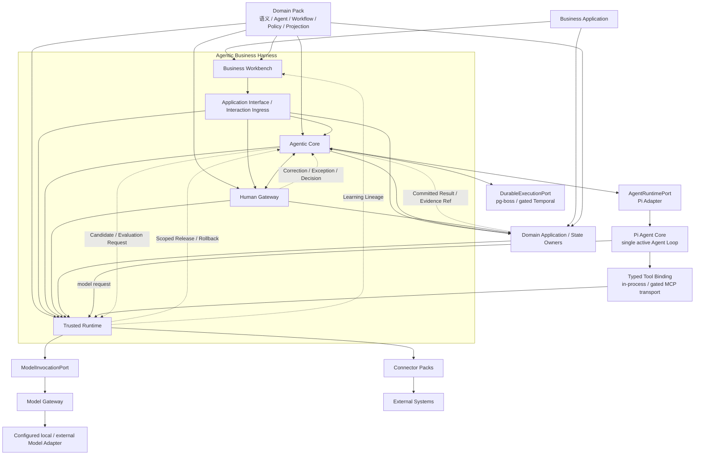
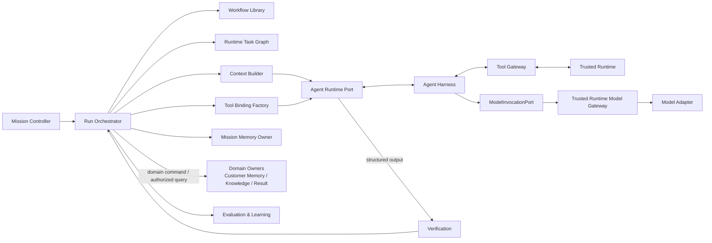
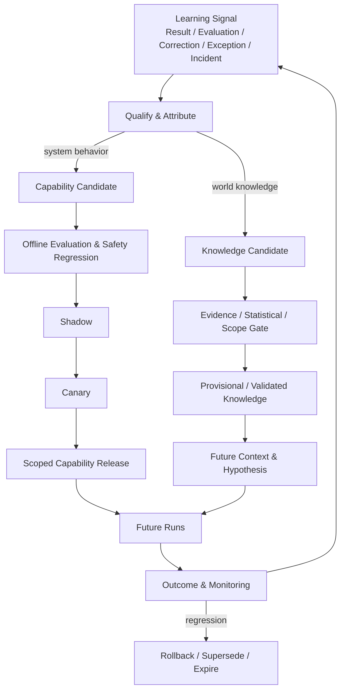

# Building Agentic Business Harness on Agent Harness

> 中文题名：构建于 Agent Harness 之上的 Agentic Business Harness
>
> 文档类型：设计科学研究论文 / Reference Architecture Paper
>
> 版本：1.12
>
> 日期：2026-09-07
>
> 说明：本文提出可证伪、可实现、可评测的参考架构。文中关于既有技术和标准的陈述以引用为依据；关于 ABH 的结构、契约和设计命题属于本文提出的设计贡献，尚需通过跨领域实现和长期生产数据进一步验证。本文是论证性论文，不定义部署 Profile；实现时以 [ABH 总体设计](Agentic-Business-Harness总体设计.md)和[系统边界与技术基线](系统边界与技术基线.md)为规范来源。ABH V1 固定 Pi Agent Core 作为唯一 Agent Loop，经 Port 隔离；持久工作默认使用 PostgreSQL/`pg-boss`，Tool 默认使用同进程强类型 Binding，Temporal 与 MCP 仅在总体设计门禁成立后启用。
>
> 许可证：Creative Commons Attribution 4.0 International（CC BY 4.0）

## Executive Summary / 执行摘要

现代 Agent Harness 已经能够承载 model—tool loop、context 和 event，部分框架还提供 checkpoint 与 human interrupt；但这些能力与真实业务运行之间仍存在目标、组织、权力、副作用、事实和学习六类结构性缺口。本文提出 Agentic Business Harness（ABH），以 Agentic Core、Human Gateway、Trusted Runtime 和 Business Workbench 组成业务级运行框架，并通过 Domain Pack 与 Connector Pack 装配行业语义和外部系统。

其中，学习缺口并非“缺少 Memory”，而是缺少一条把生产证据安全转化为未来知识与能力的业务级协议。本文提出横切四个子系统的 Learning Plane：将 Business Result、Evaluation、Human Correction、Exception、Takeover 与 Incident 统一为 Learning Signal，经 root-cause attribution 分流为 Knowledge Candidate 或 Capability Candidate。前者通过证据、统计和 Scope 门禁进入 Knowledge 生命周期；后者必须通过 independent evaluation、Shadow、scoped Canary、Capability Release、outcome attribution 和 rollback。生产 Agent 不得直接在线修改 global Prompt、Policy、Tool permission 或 model weights，也不得自评、自批或自行扩大经验 Scope。

该架构的设计目标不是无人组织，而是在明确 Goal、Grant、Policy、Resource Limit 和 Data-use 边界内，让 Agent 成为默认生产主体，让人类集中承担目标、授权、纠错和异常责任。ABH 的有效性需要通过跨 Domain Pack 实现、故障注入、对照实验和长期业务指标验证，不能由 Agent 数量、自动化演示或离线 Prompt 分数证明。

## 摘要

大语言模型 Agent 已从单轮生成发展为能够观察环境、选择工具、执行动作并依据反馈继续推理的运行系统。ReAct 证明了推理与行动交错的价值，Toolformer 研究了模型自主选择外部 API，AutoGen、Pi Agent、OpenAI Agents SDK 与 LangGraph 等框架进一步提供了 Agent Loop、多 Agent 协作、工具调用、事件流、Checkpoint 和 Human-in-the-loop 能力[1][2][3][7][8][9][10]。然而，这些能力主要回答“一个 Agent 如何完成任务”，尚不足以回答真实组织中的另一组问题：长期业务目标如何持续运行；多个 Agent 如何共享正式业务状态；人类责任如何按组织、范围和授权而非按聊天参与；外部副作用如何经过确定性控制、幂等执行、对账和补偿；结果如何形成可验证知识；反复出现的人工工作如何被安全地蒸馏为 Agent 能力。

本文提出 **Agentic Business Harness（ABH）**：建立在经运行 Profile 选定的单一 Agent Harness 之上的业务级运行框架。不同部署可以实现不同 Agent Runtime Adapter，但同一业务执行链只有一个 Active Agent Loop Owner。ABH 由四个协同而相互约束的子系统构成：Agentic Core 负责以 Mission 为单位的目标驱动、动态编排和学习闭环；Human Gateway 负责目标、授权、纠错和异常四类正式人类责任；Trusted Runtime 负责控制、执行和数据的确定性可信边界；Business Workbench 将同一运行状态投影为人类可理解的业务体验。Domain Pack 将行业对象、Agent 职责、Workflow、Action、Policy、责任模板、评测和界面投影装配到通用框架；Connector Pack 隔离外部系统协议。

为补齐学习缺口，本文进一步提出 Learning Plane。它先把业务结果、评测、人工纠错、异常处置和运行事故规范化为带来源、Scope 与数据用途的 Learning Signal，再通过根因归因区分关于业务世界的 Knowledge Candidate 与关于系统行为的 Capability Candidate。Knowledge 经过独立证据或统计门禁晋级；Agent、Prompt、Workflow、Tool、领域行为策略和 Model Route 改变则经过独立评测、Shadow、最小 Scope Canary、版本发布、效果归因和回滚。强制控制策略与评测配置具有独立发布权，候选能力不能改变用于约束或验证自己的规则。该机制将经验学习落实为可验证、可限域、可撤销的业务能力演进。

本文采用设计科学研究方法，从 Agent 系统、业务流程、自动化分级、AI 风险管理、零信任、可恢复执行和数据溯源文献中提炼设计要求，给出 ABH 的概念模型、分层结构、状态与授权不变量、执行协议、经验蒸馏机制和评测框架。为使设计命题能被独立检验，本文还要求参考实现完全自托管、默认无遥测，并公开契约、符合性测试、供应链证明和跨领域实现。核心命题是：Agent Harness 使 Agent 能工作，而 Agentic Business Harness 使业务能够在 Agent 默认生产、人类承担责任、确定性系统控制副作用的条件下持续运行。本文不声称 ABH 已获得跨行业普遍有效性的实证证明；它提供的是一项可被实现、比较、攻击和验证的参考架构。

**关键词：** Agentic Business Harness；Agent Harness；AI Native；多智能体系统；Human Accountability；可信执行；业务流程；经验蒸馏；参考架构

## Abstract

Modern agent-harness ecosystems have made it practical for language-model agents to reason, invoke tools, consume environmental feedback, and stream events; some frameworks also provide durable checkpoints, interruption, and resumption. These capabilities do not, by themselves, provide the organizational, transactional, and epistemic machinery required to operate a real business. This paper introduces the **Agentic Business Harness (ABH)**, a governed business runtime built on agent harnesses. ABH separates four concerns: an Agentic Core for mission-oriented planning and learning; a Human Gateway for accountable goal, authorization, correction, and exception handling; a Trusted Runtime for deterministic control, execution, reconciliation, provenance, and recovery; and a Business Workbench for role-aware business interaction. Domain Packs supply industry semantics while Connector Packs isolate external systems.

Using a design-science approach, the paper derives requirements from agent architectures, workflow systems, human–automation research, AI risk frameworks, zero-trust security, durable execution, and provenance standards. It specifies the core objects, cross-layer protocols, safety invariants, autonomy model, and evaluation program of ABH. Its Learning Plane separates epistemic learning from operational capability evolution: results and human interventions first become scoped learning signals, then knowledge or capability candidates, and only independently evaluated capability candidates may progress through shadow execution, scoped canaries, versioned release, outcome attribution, and rollback. To make these claims independently testable, the reference implementation must be fully self-hostable and telemetry-off by default, and must publish contracts, conformance tests, software-supply-chain evidence, and implementations across heterogeneous domains. Its central claim is deliberately narrower than “autonomous enterprise”: an agent harness makes an agent work; an Agentic Business Harness makes a bounded business process operable through agents while preserving human accountability and deterministic control. The artifact is presented as a falsifiable reference architecture rather than as an empirically proven universal solution.

**Keywords:** Agentic Business Harness; Agent Harness; AI-native systems; multi-agent systems; human accountability; trusted execution; business process; experience distillation

---

## 1. Introduction / 引言

### 1.1 从模型能力到 Agent 运行

LLM 应用的第一阶段主要把模型当作文本生成函数；Agent 系统则让模型参与工作流控制。ReAct 将推理轨迹与任务动作交错，使模型能够借助环境反馈更新计划[1]。Toolformer 进一步展示了模型可以学习决定何时调用 API、调用哪个 API 以及如何使用返回结果[2]。OpenAI 将 Agent 概括为能够代表用户独立完成任务的系统，并把模型、工具和指令列为基本组成[7]。Anthropic 区分了由预定义代码路径编排的 Workflow 与由模型动态决定过程和工具使用的 Agent，同时主张优先保持系统简单、透明并认真设计 Agent-Computer Interface[6]。

这些研究和工程框架共同形成了本文所称的 **Agent Harness**：承载模型—工具循环所需的上下文、指令、工具、事件、停止条件和运行状态的技术框架。Pi Agent Core 的公开接口直接把自己描述为具有工具执行和事件流的有状态 Agent；其运行事件覆盖 Turn、Message 和 Tool Execution[8]。LangGraph 提供 Checkpoint、Store 与 Interrupt，使图运行能够持久化、恢复并等待外部输入[9][10]。这组能力已经足以构造可靠程度不等的任务型 Agent。

### 1.2 任务成功不等于业务可运营

真实业务系统的失败单位通常不是一个模型回答，而是一次未经授权的付款、一项无法撤销的配置、一段跨租户泄漏的数据、一项无人承担责任的决定，或者一个长期目标在多次重启后失去上下文。AgentBench 的评测表明，长期推理、决策和指令遵循仍然是可用 Agent 的主要障碍[4]；这意味着把 Agent Loop 直接连接到生产系统，会把概率性判断的不确定性传播到组织和交易层。

另一方面，传统 BPM、权限系统、审批流和任务工作台虽然能够可靠保存状态，却通常把人工岗位视为默认生产节点。Workflow Patterns 研究为顺序、并行、选择、同步和多实例等控制流提供了成熟词汇[13]，但传统工作流的结构通常在运行前由人定义。AI Native 的业务系统需要同时保留确定性流程的可靠性和 Agent 对开放问题的适应性，并使人类从重复生产转为目标、授权、纠错和异常责任。

本文的问题因此不是“如何再造一个 Agent 框架”，而是：**如何在 Agent Harness 之上建立一个业务级 Harness，使 Agent 成为默认工作主体，同时让组织责任、外部副作用、业务事实和学习过程保持可控、可恢复、可审计？**

### 1.3 研究问题

本文回答七个研究问题：

1. Agent Harness 与业务运行之间缺失哪些稳定能力？
2. 哪些能力应当由概率性的 Agent 负责，哪些必须由确定性系统负责？
3. 人类如何在不退回人工流水线的条件下承担正式业务责任？
4. 行业语义如何装配到通用框架，而不污染框架内核？
5. Result、人工经验和运行事故如何在不产生自我确认、跨客户泄漏或在线失控的前提下，转化为可验证知识与可回滚能力？
6. 如何评测一个 ABH 是否真正提高业务自治，而不只是增加 Agent 数量或模型调用？
7. 一项符合性声明如何被非原作者使用公开实现、测试和制品独立验证？

### 1.4 研究贡献

本文给出五项设计贡献：

- 定义 Agentic Business Harness 及其与 Agent Harness、业务应用和外部系统的边界；
- 提出 Agentic Core、Human Gateway、Trusted Runtime、Business Workbench 四子系统参考架构；
- 给出 Mission、Decision、Grant、Action、Operation、Result、Knowledge 等业务级契约与不可绕过的不变量；
- 提出横切四个子系统的 Learning Plane，将业务知识进化与系统能力进化分离，并以独立评测、最小 Scope 发布、效果归因和回滚治理经验蒸馏。
- 将完全自托管、可导出、公开符合性测试、可验证供应链和跨领域参考实现定义为架构可验证性的一部分。

---

## 2. Research Methodology / 研究方法

### 2.1 设计科学方法

本文采用信息系统设计科学方法。Hevner 等人认为，设计科学通过构建和应用人工制品获得对问题域及解决方案的认识[12]。ABH 因而被视为由词汇、参考架构、契约、不变量、扩展机制和评测方法共同构成的设计人工制品，而不是一个已由观察数据证明的自然规律。

研究过程包含四步：首先从 Agent 框架、业务流程、自动化、人机协作、AI 风险和分布式系统中识别要求；其次将重复出现的要求收敛为最少的稳定责任；再次构造可以由 Domain Pack 扩展的参考架构；最后定义可通过实现、故障注入、跨领域复用和生产指标验证的设计命题。

### 2.2 证据范围

本文使用 23 个来源：学术论文用于 Agent 推理/工具、人机自动化、工作流、自治计算和设计科学；官方技术文档用于核实 Agent Loop、持久执行和中断机制；政府/监管文件用于风险、零信任和人类监督；开放标准与协议用于溯源、事件、观测和工具互操。来源覆盖 2000—2026 年。由于部分来源同时具有论文、规范和开源实现属性，本文不用互斥数量对其做人为分类。

本文没有把厂商文档中的产品能力当作普遍规律。厂商来源只证明相应机制已在某类实现中出现；ABH 的跨层组合与命名是本文的设计综合。论文也不使用“生产领先”“提高百分之多少”等缺乏跨组织实验的数据。

### 2.3 设计目标

设计人工制品必须同时满足以下目标：

| 目标                   | 可验证含义                                        |
| -------------------- | -------------------------------------------- |
| Agent-first          | 常规业务产出由 Agent 或确定性自动化完成，人类不是固定搬运节点           |
| Accountable          | 每个目标、授权、纠错和异常都能解析到有权责任主体                     |
| Bounded              | Agent 不能自行扩大目标、权限、预算、数据用途或工具能力               |
| Durable              | 长期运行可暂停、恢复、重放和对账，不依赖单次模型上下文                  |
| Effect-safe          | 外部副作用具有强类型、幂等、前置条件、回执、未知结果处理和补偿语义            |
| Epistemically honest | 事实、推断、实验结论和批准不混为一种“AI 结论”                    |
| Domain-extensible    | 通用层不硬编码某个行业对象、岗位或界面                          |
| Experience-seeking   | 重复人工介入被识别为能力缺口，并在验证后进入 Agent/Workflow/Policy |
| Independently verifiable | 第三方能仅用开放实现、机器契约、测试包和签名制品重现符合性结论 |

---

## 3. Main Analysis / 相关工作与结构性缺口

### 3.1 Agent Loop、工具与多 Agent

ReAct、Toolformer 与 AutoGen 分别覆盖推理—行动交错、工具使用和多 Agent 对话编排[1][2][3]。OpenAI 的工程指南把单 Agent Loop 和多 Agent 编排视为两类运行模式，并建议先最大化单 Agent 能力，再在复杂性确有需要时引入多 Agent[7]。Anthropic 同样强调只有在简单方案不足时增加 Agentic 复杂度[6]。这些工作支持 ABH 的两个判断：其一，Agent 是处理语义不确定性和动态任务分解的合适单元；其二，“多 Agent”不应成为架构目标，按 Mission 组建的最小责任团队比固定的大型 Agent 组织更可靠。

Agent Harness 解决的典型问题包括：如何构造上下文、调用模型、选择工具、把工具结果反馈给模型、流式发布事件、停止循环、压缩会话和保存 Checkpoint。MCP 为 LLM 应用连接资源、Prompt 和工具提供标准协议，但其规范也明确指出协议本身不能强制执行全部授权和安全原则，宿主仍需实现同意、访问控制和数据保护[23]。因此，工具可发现性和协议互操作不能替代业务授权与副作用治理。

### 3.2 Agent-Computer Interface 与业务接口

SWE-agent 把 Agent 视为一类具有独特需要的计算机终端用户，并显示专门设计的 Agent-Computer Interface 会显著影响 Agent 行为和任务表现[5]。这说明 Harness 的价值不只来自模型，也来自环境接口、工具粒度、反馈质量和状态表达。ABH 把这一思想从“Agent 如何操作计算机”扩展为“Agent 如何操作业务”：工具必须使用行业对象和强类型意图，而不是把底层 API、数据库或通用 Shell 直接暴露给 Agent。

例如，“提高转化”不能直接映射为任意 HTTP 请求；它应先产生业务 Plan，再形成受预算、权限、对象版本和风险策略约束的 Proposed Action。ABH 因而需要位于 Agent Harness 与外部系统之间，将开放式推理收敛为可验证的业务契约。

### 3.3 可恢复工作流与长期目标

LangGraph 的 Checkpointer 能保存线程状态，Store 能保存跨线程长期信息，Interrupt 能暂停运行并等待人类输入[9][10]。Temporal 通过 Event History 与 Replay 使 Workflow Execution 在失败后从已记录事件继续[11]。这些机制证明了持久化和恢复可以作为运行时能力实现，但业务层仍需决定“恢复什么”：Mission 的目标、正式对象版本、未完成责任事件、已生效外部动作和待验证知识，不能只等同于一段会话或图状态。

自主计算早期工作将自配置、自修复、自优化和自保护组织为受高层目标约束的管理循环[15]。ABH 吸收其“目标与反馈循环”思想，但将自主系统的技术目标扩展为带 Organization、Human Responsibility、Grant、业务 Result 和可逆能力发布的业务目标，避免把“系统自调节”等同于“系统可以自行承担业务责任”。

ABH 因此区分长期 `Mission` 与阶段性 `Run`。Agent Harness 的 Session、Thread、Turn 和 Message 是运行细节；Mission 是跨多次 Run、模型版本、人工决定和外部结果持续存在的业务承诺。

### 3.4 人机自动化与责任

Parasuraman、Sheridan 和 Wickens 将自动化理解为可分别作用于信息获取、分析、决策选择和行动执行的多个等级，而不是单一开关[14]。该模型启发 ABH 把“Agent 能力”和“被授权的自主程度”分离：模型可以具备提出某项动作的能力，但是否能够执行取决于当前目标、风险、额度和 Grant。

欧盟《人工智能法》第 14 条要求特定高风险 AI 系统具备有效人类监督，使有权人员能够不使用系统或忽略、覆盖、逆转其输出[19]。虽然 ABH 面向的所有应用并不都属于该法规的高风险分类，这一原则仍为可逆性、停止权、能力与授权分离提供了强参考。Human Gateway 的目标不是在每一步插入人类，而是确保必须由人承担的责任能够找到具备能力、训练和权限的人，并形成可审计决定。

### 3.5 风险、零信任、溯源与可观测性

NIST AI RMF 用 GOVERN、MAP、MEASURE、MANAGE 组织 AI 风险活动，并将可靠、安全、韧性、可问责、透明、可解释、隐私增强和公平列为可信 AI 的特征[16]。NIST 的生成式 AI Profile 进一步强调治理、内容来源、部署前测试和事件披露[17]。这些要求不能仅靠系统 Prompt 实现，需要独立于 Agent 的强制控制、评测、审计和事件响应。

NIST Zero Trust Architecture 主张不基于网络位置授予隐式信任，并采用逐请求、最小权限的策略判断与执行点[18]。ABH 将该原则应用于 Agent：一次 Human Session 的权限不能被整个 Run 隐式继承；每个 Agent Invocation、Tool Binding 与 Action 都必须具有显式身份、Scope、用途和时效。

W3C PROV 用 Entity、Activity 和 Agent 表达来源与责任关系[20]；CloudEvents 用统一上下文描述跨系统事件，并要求 `source + id` 对不同事件保持唯一[21]；OpenTelemetry 用 Trace、Span、Event 和 Link 表达因果运行路径[22]。ABH 复用这些成熟结构分别承载 Evidence、领域事件和 Trace，但拒绝用 Trace 代替正式业务事实或 Audit。

### 3.6 六类结构性缺口

现有 Agent Harness 与真实业务运行之间存在六类结构性缺口：

| 缺口 | Agent Harness 通常已有 | 业务运行仍然需要 |
|---|---|---|
| 目标缺口 | Prompt、Session、Run | 跨运行的 Mission、约束、成功条件和终止权 |
| 组织缺口 | User input、HITL interrupt | Organization、责任解析、委托、职责分离和双边授权 |
| 权力缺口 | Tool allowlist、回调钩子 | 对象、动作、条件、金额、用途、期限和版本化 Grant |
| 副作用缺口 | Tool call / tool result | Action—Operation—Attempt—Receipt—Reconciliation |
| 事实缺口 | Transcript、Checkpoint、Trace | 正式业务对象、来源、版本、Evidence、Result 和 Audit |
| 学习缺口 | Memory、Prompt 优化 | 假设—实验—知识晋级与人工经验蒸馏 |

学习缺口具有特殊性：前五类缺口主要决定“这一次业务能否正确运行”，学习缺口决定“系统能否从多次运行中变得更好而不积累不可控风险”。Transcript 或 Memory 只能说明系统保存了什么，Prompt 优化只能说明行为配置发生了变化；两者都不能单独证明被学习的经验真实、改变针对正确根因、适用范围没有被夸大，或新版本比基线更好。若没有独立门禁，系统甚至可能把自身生成的错误当作训练证据，形成自我确认回路。

因此，ABH 的学习目标不是最大化记忆量或在线自修改速度，而是最大化**经验证、可归因、可限域和可撤销的业务学习**。这一要求同时依赖正式 Result、Human Gateway 的责任信号、Agentic Core 的归因与评测，以及 Trusted Runtime 的版本发布和回滚。ABH 的设计对象正是填补这六类缺口，而不是替换底层 Harness。

---

## 4. Synthesis & Reference Architecture / Agentic Business Harness 的定义

### 4.1 定义

**Agentic Business Harness 是建立在 Agent Harness 之上的业务级运行框架。它把长期业务目标转换为可恢复的 Agent 与 Workflow 运行，通过显式人类责任接口获得目标、授权、纠错和异常决定，通过确定性可信底座控制外部副作用与业务事实，并把可验证结果和人工经验反馈为后续能力。**

简化表达是：

> An Agent Harness makes an agent work. An Agentic Business Harness makes a bounded business process run through agents.

“bounded” 是定义的一部分。ABH 不以无边界自治为目标；它以目标范围内的持续自主、可问责的人类边界和不可绕过的确定性控制为目标。

### 4.2 分层关系



依赖方向必须单向稳定：业务应用依赖 ABH；Domain Pack 通过公开 SDK 向 Domain Application 和四个 ABH 责任域注入定义；Domain Application 是业务语义与聚合状态的 Owner，不是第五个 ABH 子系统。ABH V1 通过 `DurableExecutionPort`、`AgentRuntimePort`、`ModelInvocationPort` 以及 Tool Binding/`ToolProtocolPort` 边界分别隔离持久工作实现、Pi、模型供应商与 Tool 传输。图中的连线表达运行时调用：Durable Adapter 只唤醒 Core，不会调用 Pi；Pi 只在 `AgentRuntimePort` 之后运行，其模型请求仍通过 Trusted Runtime 中的 Model Gateway 执行许可列表、Purpose/Data-use、成本、Secret 和 Audit 控制；Tool 调用必须重入 Trusted Runtime，不会从持久队列直接穿到外部系统。

M0 的持久工作和 Agent Runtime 默认实现分别为 PostgreSQL/`pg-boss` 与 Pi，Tool 默认使用同进程强类型 Binding，不需要部署 MCP；Temporal 与 MCP 仅在规范性总体设计门禁成立后启用。Connector Pack 适配外部系统。第三方框架、模型供应商或外部 API 的对象不能反向成为通用业务模型。图中的虚线反馈构成 Learning Plane；它复用四个子系统的控制权，不增加第五个可以绕过 Human Gateway 或 Trusted Runtime 的系统边界。

### 4.3 四个子系统

| 子系统 | 回答的问题 | 核心责任 |
|---|---|---|
| Agentic Core | 业务目标如何由 Agent 持续完成并改进？ | Mission、Run、动态编排、上下文、验证、Mission Memory 和能力学习编排；领域 Knowledge 由 Domain Owner 提交 |
| Human Gateway | 何时需要谁承担哪一种人类责任？ | Responsibility Event、责任解析、Decision、纠错、升级和接管；Grant 由 Trusted Runtime Control 拥有 |
| Trusted Runtime | 什么被允许，如何可靠执行，事实如何保存？ | Control、Execution、Data 三个 Plane，权限、限额/配额、Action、对账、审计与恢复 |
| Business Workbench | 不同人如何理解和管理同一运行状态？ | 角色化业务投影、委托、待办、解释、编辑、接管和组织管理 |

四者不是四套必须独立部署的服务。它们是四种不可混淆的控制责任：Agent 不能批准自己的越界动作，界面不能成为事实源，审批流不能承担日常生产，确定性 Runtime 不能伪装成语义 Agent。

### 4.4 Domain Pack 与 Connector Pack

Domain Pack 是 ABH 的行业装配单元，至少定义：

```text
DomainPack
├── Manifest & Compatibility
├── Vocabulary & Object Schemas
├── Agent Definitions
├── Workflow Definitions
├── Tool & Action Types
├── Policies & Risk Taxonomy
├── Responsibility Templates
├── Memory & Knowledge Schemas
├── Evaluation Suites
├── Business Projections
└── Workbench Extensions
```

Connector Pack 只负责外部能力和协议差异，包括认证方式、读取能力、写入 Operation、限流、幂等支持、回执、Webhook、对账和错误映射。领域包表达“创建一项已暂停的营销活动”，连接器表达 Meta、Google 或其他平台如何实现；二者不能合并，否则平台 API 会污染业务语义。

---

## 5. 参考架构

### 5.1 Agentic Core

Agentic Core 以 `Mission` 为长期业务单元，以 `Run` 为阶段性可恢复执行，以 `Agent Definition` 表达稳定责任，以 `Workflow` 和运行时 `Task Graph` 结合确定性骨架与动态规划。



Agentic Core 采用两层循环：Mission Loop 跨天、跨月观察业务结果并决定继续、再规划、暂停或结束；Run Loop 在较短时间内执行 Observe—Plan—Act—Verify—Update。固定的校验、分支、等待和提交由 Workflow 控制；需要语义判断、创造和开放式分解的节点才调用 Agent Harness。

### 5.2 Human Gateway

Human Gateway 只承载四类正式责任：

| 类型 | 含义 | 典型产物 |
|---|---|---|
| Goal | 建立或实质改变业务目标和硬约束 | Goal Decision、Mission Amendment |
| Authorization | 对某对象、动作、额度、条件和期限内的授权做出正式决定 | Authorization Decision；由 Trusted Runtime Control 将可机器执行的结果具现化为 Approval Grant |
| Correction | 纠正事实、偏好、判断或已生成产物 | Correction Record、替代版本 |
| Exception | 处理 Agent 无法在现有边界内安全收敛的问题 | Exception Decision、Takeover、Policy Exception |

Human Gateway 的通用责任主体称为 `Responsibility Principal`；具体产品可以将其映射为 Manager、Owner、Approver 或 Reviewer。Product Responsibility 决定谁有资格对某类事项负责，Approval Grant 决定主体可以执行的具体动作；两者分别失效，不相互推导。责任解析至少考虑 Organization、Workspace、对象 Scope、责任类型、动作、风险、职责分离、委托和有效期。聊天中的“好的”不构成正式授权；有效 Decision 必须具有明确对象、版本、影响、选项、决定者身份和生效范围。Decision Outcome 只能由相应 Owner 转换为 Grant、对象修订或 Takeover，Human Gateway 不跨边界直写这些状态。

### 5.3 Trusted Runtime

Trusted Runtime 包含三个逻辑 Plane：

| Plane | 稳定责任 |
|---|---|
| Control Plane | 身份、租户、授权、Policy、限额/配额、自主等级、模型/工具允许范围、职责分离和审计 |
| Execution Plane | Tool Gateway、Action Engine、Operation、Adapter、Secret、幂等、限流、熔断、调度、对账和补偿 |
| Data Plane | 为状态 Owner 提供正式事实提交、Event/Outbox、Artifact、Evidence、Memory、Knowledge、Result、Lineage、Index 和 Audit 底座；领域迁移语义仍属于对应 Domain Owner |

任何外部副作用都必须沿以下链路执行：

```text
Business Intent → Action: Proposed
  → RequestContext + Action Target + upstream authority refs
  → Capability + Mandatory/Behavior Policy + Grant/Resource Preflight
  → Action-specific Authorization Snapshot + applicable Reservation/Commitment
  → Action: Authorized → Operation → Attempt → Receipt → Reconciliation
```

`Action` 表达领域业务意图；Proposed 是已持久的提案。Action Engine 以经过认证的 RequestContext、Action Target 和上游权限引用请求 Preflight，上游 Invocation/Tool Snapshot 只证明来源。Control 固定唯一适用行为版本，检查 Grant、Purpose、两类 Policy、对象版本和适用资源预留；Action 专属 Authorization Snapshot 与必要预留一致提交后，才签发 AuthorizedRequestContext 并允许进入 Authorized。Operation Dispatch 时继续重验当前权限、强制控制策略和版本有效性。

Policy 分为两类，由同一确定性引擎求交：Mandatory Control Policy 由 Trusted Runtime 独立发布，约束身份、租户、用途、职责分离、硬限额与禁止动作；Domain Behavior Policy 随能力版本表达领域建议、质量、责任路由和附加限制。行为策略只能在强制边界内生效，不能覆盖 Mandatory Deny、减少强制义务或扩大 Grant。Capability Release 固定行为版本，授权仍由当前责任与 Grant 决定。

`Operation` 是面向某个连接或资源边界的执行单元；`Attempt` 是一次可能失败或超时的调用；`Receipt` 保存外部回执；`Reconciliation` 根据外部事实确认最终结果。补偿作为新的 Action 执行并引用被补偿的 Operation，历史事实保持可追溯。

### 5.4 Business Workbench

Business Workbench 是面向人类的业务体验框架，而非 Agent 调试控制台。它提供 Organization/Workspace 上下文、Mission 组合、目标与结果摘要、待办和异常、版本比较、Action 状态、解释与纠错、接管、权限与连接管理。Domain Pack 通过 Projection 和 UI Extension 将内部对象转换为行业语言。

Workbench 中的自然语言助手可以接受普通委托、解释状态和导航对象；一旦输入涉及目标、授权、纠错或异常责任，交互必须转入 Human Gateway 的结构化协议。用户不需要理解 Run、Turn、Task Graph 或 Operation，但系统必须能在需要时渐进披露证据、版本、授权和执行事实。

---

## 6. 核心对象与形式化不变量

### 6.1 对象集合

设一个 ABH 实例中必须持久、由唯一 Owner 提交并可用于恢复或审计的正式状态为：

\[
S = \{O, W, M, R, D, G, Q, A, B, E, K\}
\]

其中：

- \(O\)：Organization 与身份边界；
- \(W\)：Workspace 与跨组织协作边界；
- \(M\)：Mission 及目标、约束和生命周期；
- \(R\)：Run、Task Graph、Checkpoint 和运行预算；
- \(D\)：Decision 与责任链；
- \(G\)：Grant、Delegation 和 Policy Snapshot；
- \(Q\)：Resource Limit、Quota、Reservation 与 Commitment；营销领域将其具体化为 Budget 与 Spend Commitment；
- \(A\)：Action、Operation、Attempt、Receipt 与 Reconciliation；
- \(B\)：Domain Pack 定义的正式业务对象；
- \(E\)：Evidence、Result、Lineage 与 Audit；
- \(K\)：Memory、Knowledge、Learning Signal/Case、Capability Candidate、Evaluation 与 Capability Release。

Projection、检索索引和缓存是从 \(S\) 构造的可重建读模型。模型 Context、Transcript、Workflow History 和 Trace 是按恢复、评测与诊断需要保留的运行记录；它们可以引用 \(S\)，但不能反向覆盖或替代 \(S\) 中的授权、领域对象、Result 或 Audit。纳入 \(S\) 只表示状态受治理，不表示所有对象具有相同证据强度：Memory 只能帮助构造上下文，Candidate 只能进入评测，它们都不能独立授权、证明因果或覆盖已提交事实。其中 Mission Memory 由 Agentic Core Memory Owner 提交，领域/Customer Memory 与 Knowledge 由 Domain Owner 提交，Learning Signal/Case/Capability Candidate 由 Evaluation & Learning 提交，Capability Release/Assignment 由 Capability Release Controller 提交。

### 6.2 Action 可执行条件

一个 Proposed Action \(a\) 只有在执行时刻 \(t\) 同时满足以下条件，才可以进入执行：

\[
Executable(a,t) = Identity \land Tenant \land Authority \land Purpose \land Policy \land ResourceLimit \land Version \land Preconditions \land Capability \land Freshness \land \neg Stopped
\]

各项分别表示：调用身份和凭据 Epoch 有效；租户/双组织隔离成立；Actor 具备与其类型匹配的权限链——Human 使用 Product Responsibility/Grant/Delegation，AgentInvocation 使用绑定当前 Mission/Run 的 Principal、Mission Authority 和必要上游人类责任链，Service 使用 Service Capability/Execution Authority——且 Grant/Execution Authority 覆盖 Scope、动作、条件、金额与期限；数据用途允许；Policy/职责分离允许；限额、配额与适用的持续负债已预留；对象版本和业务前置条件有效；所用工具/连接能力有效；依赖数据未超过时效；且没有命中撤权、冻结、取消或紧急停止。Agent 的置信度不出现在这个公式中，因为置信度不能替代授权。

### 6.3 责任不变量

ABH 必须保持：

1. Agent 可以提出 Decision Request、建议选项和 Proposed Action，但不能写入人类 Decision 或签发扩大自身权限的 Grant；
2. 提出高影响 Action 的 Agent Invocation 与批准该 Action 的 Responsibility Principal 具有不同审计身份；
3. 人类责任随介入频率降低而不消失；L4 自主表示更大的预授权范围，不表示无人负责；
4. Human Gateway 记录责任与决定，Trusted Runtime 计算可执行权限；二者不能以对方的记录替代自己的判断；
5. 委托只转移明确 Scope 内的处理权，不能隐式转移法律、财务或组织最终责任。

### 6.4 事实与来源不变量

1. Data Plane 中已提交的领域对象是内部正式事实；外部系统是其原生对象的事实源；
2. 每个 Result 引用输入对象版本、Action/Operation、数据窗口、计算版本和 Evidence；
3. Trace 用于诊断运行，Audit 用于证明责任和控制，Evidence 用于支持业务主张，三者相互引用但不互相替代；
4. Event 描述已提交事实，不能用事件消费者绕过同步授权；
5. 任何从外部数据或模型输出派生的正式对象都保留来源、时间、版本和转换血缘。

### 6.5 知识晋级不变量

Knowledge 采用 `Candidate → Provisional → Validated → Superseded / Expired` 生命周期。晋级函数可表示为：

\[
Promote(k) = EvidenceQuality \land Reproducibility \land ScopeValidity \land IndependentGate \land NoCriticalConflict
\]

Agent 可以生成 Candidate 和解释 Result；高价值知识的统计显著性、数据完整性、Policy 符合性和可复现哈希应由确定性 Engine 或独立评测计算，避免同一 Agent 同时提出假设、解释数据并批准自己的结论。

---

## 7. 运行协议

### 7.1 Mission 生命周期

Mission 从有权主体定义的目标开始，包含成功条件、预算/资源边界、风险边界、数据用途和终止权。Mission Controller 根据业务事件、时间计划、Human Decision 或外部 Result 唤醒 Run。Run Orchestrator 从 Workflow 建立初始 Task Graph，Agent 可以提出 Graph Patch，但确定性控制器验证依赖、预算、并发和循环上限后才提交。

### 7.2 上下文构造

每次 Agent Invocation 只接收完成当前任务所需的 Context Manifest：目标与任务契约、对象引用和版本、约束与授权摘要、必要 Memory/Knowledge/Evidence、允许工具、剩余 Run Budget、未解决分歧和输出 Schema。完整客户资料、其他 Agent 的隐藏推理或发起人的全部权限不默认广播。

### 7.3 动态 Agent 团队

Agent Definition 表达稳定业务责任，Agent Instance 表达一次 Mission/Run 中的具体执行。默认使用能够完成任务的最小团队和单路径执行；只在高不确定性、高影响、新领域或证据冲突时并行多个实例。并行分支基于同一只读事实版本，在隔离工作区形成候选产物；合并通过显式 Merge Proposal、版本前置条件和验证器完成。

### 7.4 Human Responsibility Protocol

当 Core 识别到目标缺失、授权不足、重要纠错或不可安全收敛异常时，生成 Responsibility Event。Human Gateway 将其分类，解析有权主体，构造 Decision Package，按照最短有效路径路由。Decision Package 至少包括：提出方、责任 Organization、对象和版本、建议、替代方案、影响、最大风险、Evidence、授权范围、期限和可撤销性。

人类提交决定后，Trusted Runtime 重新校验 Session、责任、职责分离和对象版本。验证通过后，决定结果由唯一 Owner 分别提交：Control 创建或引用 Grant，相应 Domain Owner 提交目标/纠错对象版本，Action Engine 使用有效 Authorization Snapshot 处理副作用意图。过期、撤权或冲突的决定保持历史记录，但不产生执行权。

### 7.5 外部执行与未知结果

Action Engine 先以幂等键保存 Proposed Action 及来源对象版本；当 Active Capability Assignment、授权快照、Policy 与适用的 Resource Reservation/Commitment 在同一可证明边界中成立时，它再将 Action 转为 Authorized 并写入 Outbox。Operation Controller 在 Action Validated 后按固定 Connector Capability 无副作用地生成不可变 Operation Plan；授权事务必须验证并绑定 planDigest，Worker 仅派发该获准计划。Operation Controller 唯一写入 Operation/Attempt/Receipt；Action Engine 保存 Plan Ref 并汇总父 Action 结果。Action 键标识业务意图，Operation 键由 Action/计划节点/连接边界稳定派生，同一 Operation 的各 Attempt 复用同一 Provider 幂等键。外部超时不能直接标记失败并盲目重试，因为外部系统可能已接受请求。系统先进入 `Unknown`，使用查询、稳定命名/标签、外部 ID 或对账窗口确定结果；只有确认未生效且重试安全时才创建新 Attempt，多个匹配则进入 Duplicate Exception。Provider 既无原生幂等也无可靠查询标记时，高影响创建不进入自动执行范围。Error Registry 表达失败原因与处置，Unknown 表达副作用事实尚未确定，两者不得压缩为同一个错误枚举。

跨平台或跨账户动作拆成多个 Operation。父 Action 按明确聚合规则呈现 `Succeeded`、`PartiallySucceeded`、`Failed` 或 `Unknown` outcome；它的生命周期状态仍由独立契约表达，部分成功不会被一个布尔值掩盖。回滚不可行时，补偿 Action 用新的业务意图修正外部状态。

### 7.6 恢复与重放

Run 从最近有效 Checkpoint 恢复，但恢复不是简单重放模型调用。系统复用已完成的 Agent 产物和工具结果，重新读取正式对象、授权、预算、时效和外部事实；已经产生副作用的 Step 通过 Action 幂等键和对账确认，而不是再次调用。Workflow 版本变化时，需要兼容迁移或从新 Run 继续，不能用新代码无条件重放旧历史。

---

## 8. Learning Plane：补齐学习缺口

### 8.1 学习缺口的准确含义

Agent Harness 通常提供 Transcript、Memory、Checkpoint、Tracing 和基础 Evaluation。这些机制能保存上下文、恢复运行或测量一次输出，却没有自动回答四个业务学习问题：什么信号值得学习；应该改变业务知识还是系统能力；新经验适用于哪个客户、场景和风险范围；改变之后如何证明效果、控制发布并在退化时回滚。若直接把一次对话摘要写进 Memory，或依据少量成功案例改写全局 Prompt，系统会把偶然相关、人工偏好、错误结论和客户私有信息扩散为未来行为。

NIST 的生成式 AI Profile 把治理、内容来源、部署前测试和事件披露列为重点，并要求保留测试、评测和事件历史[17]；W3C PROV 则提供 Entity、Activity 与 Agent 的来源和责任关系[20]。因此，ABH 所解决的“学习”不是模型在生产环境中自行更新权重，而是一个受治理的闭环：**将 Result、评测、人类责任事件和运行事故转化为带来源的学习信号；将信号归因为业务知识或系统能力候选；通过独立门禁验证；按最小 Scope 渐进发布；持续测量后续效果并支持撤销。** Learning Plane 是贯穿 Agentic Core、Human Gateway、Trusted Runtime 与 Business Workbench 的协议，不是拥有独立权限的第五个子系统。

### 8.2 设计要求与跨层责任

Learning Plane 必须满足七项设计要求：

| 要求 | 含义 | 违反后的典型失败 |
|---|---|---|
| Provenance-first | 每个信号保留来源、对象版本、Actor、时间和 Evidence | 无法判断系统从什么学到结论 |
| Type separation | 业务知识与系统能力进入不同对象和生命周期 | 实验结果直接改写 Prompt 或 Policy |
| Attribution-before-change | 先判断根因，再选择要改变的资产 | 把 Connector 故障误判为 Agent 权限不足 |
| Independent gate | Producer、Evaluator、Release Authority 与使用数据相互分离 | Agent 用自身输出证明自身正确 |
| Scoped generalization | 候选只能发布到证据覆盖的最小 Scope | 单客户偏好污染跨客户全局行为 |
| Reversible release | 版本、分配、停止条件和回滚路径完整 | 退化后无法恢复已知安全版本 |
| Outcome attribution | 发布后测量相对基线的增量效果和代价 | 只因环境变好便声称系统学会了 |

这七项要求被分配到既有四个子系统。Agentic Core 的 Evaluation & Learning 负责 Signal 资格判断、聚类、根因归因、Capability Candidate 和评测编排，并向领域 Knowledge Owner 提交 Knowledge Candidate Command；Domain Owner 拥有 Knowledge 迁移；Human Gateway 把 Correction、Exception、Takeover 和 Decision 转为正式责任信号，并为高风险发布找到有权主体；Trusted Runtime 保存 Learning Lineage，由 Capability Release Controller 执行 Shadow、Canary、版本分配、暂停与回滚；Business Workbench 让用户看到系统从什么证据学到什么、在哪个 Scope 生效，并提供纠错和撤回数据用途的入口。任何一层都不能单独完成或绕过整个学习闭环。

对学习信号 (x) 和目标作用域 (s)，安全晋级的最低条件可以写为：

\[
Admissible(x,s) = Provenance \land DataUseValid \land RootCauseAttributed \land IndependentEvidence \land ScopeSupported(s)
\]

这一条件只表示候选具备进入相应门禁的资格，不表示 Knowledge 已成立或 Capability 可以发布。Knowledge 还需满足领域证据与统计标准；Capability 还需满足安全回归、版本兼容、Shadow/Canary 和回滚要求。

### 8.3 两条正交学习回路

ABH 区分两条同时运行、对象和晋级门槛不同的回路：

1. **Epistemic Learning / Knowledge Evolution**：学习“在什么 Scope、时间和证据条件下，关于业务世界的什么主张成立”。产物是 Customer Memory、Insight 和 Knowledge，不直接修改系统执行能力。
2. **Operational Learning / Capability Evolution**：学习“面对哪类输入、异常或责任事件，系统怎样工作更好”。运行产物是 Agent Definition、Prompt、Workflow、Tool、Domain Behavior Policy 和 Model Route 的新版本；涉及代码或领域 Schema 时还需常规构建、迁移与部署发布。评测案例改进进入独立评测治理，强制控制策略进入独立安全发布，二者保持对生产能力的独立约束。

客户偏好“标题更克制”可能形成 Customer Memory；随机实验显示某类标题提高增量转化，经过独立统计门禁后才可能成为 Validated Knowledge；人工发现某类声明总需法律复核，则应形成 Policy Candidate 和回归评测。三者来源可能相同，但作用对象、风险和发布路径不同。



### 8.4 学习信号契约

所有学习输入首先形成 `Learning Signal`，而不是直接写入 Prompt、Policy 或 Knowledge：

```text
signalId / signalType / occurredAt
organizationId / workspaceId / domain / subjectScope
missionRef / runRef / taskRef / objectVersionRefs
sourceActor / sourceSystem / evidenceRefs
observedBehavior / expectedBehavior / delta
humanChange / rationale / responsibilityType（如适用）
businessOutcome / safetyOutcome / costOutcome（可延迟补充）
dataUse / sensitivity / retention / deletionRefs
confidence / knownAlternatives / validityWindow
```

信号来源包括：业务 Result 与 Experiment、Agent/Workflow 离线和在线评测、Human Gateway 的 Correction/Exception/Takeover/重复 Decision、Action/Operation 事故、Policy 拦截、用户采纳或拒绝、模型/Connector 漂移以及成本和延迟异常。点击、点赞或一次成功只表达弱信号，不能单独晋级高影响能力。

### 8.5 从信号到候选：归因而非照抄

Agentic Core 的 Evaluation & Learning 对相似信号聚类，并把重复介入归因到以下一个或多个根因：缺少事实或数据、检索失败、上下文组装错误、工具能力不足、Workflow 缺口、Agent 判断错误、验证器不足、Policy 缺口、责任配置错误、外部系统限制或 UI 误导。只有完成根因归因，它才创建 `Capability Candidate` 或向对应 Domain Knowledge Owner 提交 `Knowledge Candidate` Command。

候选记录目标资产、基线版本、建议变更、适用 Scope、预期效果、风险等级、所需数据用途、支持/反对 Evidence、评测计划、发布计划和回滚版本。人工做了什么不等于系统就应该模仿什么；例如人工绕过一个故障平台完成投放，可能暴露 Connector 缺口，而不是证明应放宽 Agent 权限。

### 8.6 独立门禁与防止自我确认

提出假设或生成产物的 Agent 不能成为唯一评测者和发布者。门禁采用三种分离：

- **角色分离**：Producer Agent、Evaluator/Deterministic Engine、Release Authority 使用不同身份和 Audit；
- **数据分离**：训练/蒸馏样本与保留评测集、事故集和对抗集隔离；
- **时间分离**：离线回放、Shadow、Canary 和生产观察依次进行，不依据同一批历史数据同时选择并证明方案。

独立性还必须落实到门禁选择权：Evaluation Profile 将 Suite、Dataset Snapshot、Evaluator、Metric 与 Threshold 冻结为可寻址配置，在候选运行前由独立规则按资产类型和风险选定。Producer 不能修改保留集或选择一个容易通过的门槛；仅更换 Evaluator 身份或使用同一个模型的第二次调用，不构成独立证据。模型评审只提供质量信号，统计、权限和副作用结论由确定性计算或相应有权责任人把关。

评测配置自身改进使用独立黄金集、事故集、对抗集和新旧双跑；生产 Release 只引用 Gate Artifact/评测配置作为验证证据，不把用于证明自己的评测集一起作为行为资产分配。Mandatory Control Policy 始终由安全发布链控制，Capability Canary 不能放宽其限制。

Capability Candidate 的晋级条件可表示为：

\[
Release(c,s) = ReproducibleEval \land QualityGain \land NoSafetyRegression \land ScopeEvidence(s) \land DataUseValid \land RollbackReady
\]

其中 \(s\) 是发布 Scope。候选只能在证据覆盖的最小 Scope 内发布；从单 Mission 扩展到客户、Organization、Domain Pack 或全局框架都属于重新晋级。高风险 Policy、权限、预算和合规变更需要对应 Manager 或治理责任人，Agent 评测通过不能代替人类授权。这一分离回应了 NIST AI RMF 对组织问责、持续测量和风险管理的要求[16]，以及欧盟《人工智能法》关于有权人类能够忽略、覆盖或逆转系统输出的监督原则[19]。

### 8.7 能力发布账本与可逆性

系统保存不可断裂的 Learning Lineage：

```text
Learning Signal
  → Learning Case / Cluster
    → Knowledge Candidate / Capability Candidate
      → Evaluation Run & Dataset Snapshot
        → Shadow / Canary Assignment
          → Capability Release
            → Affected Runs / Decisions / Actions / Results
              → Promotion / Supersede / Rollback
```

每个 Release 固定 Agent/Prompt/Workflow/Tool/Domain Behavior Policy/Model Route 的精确版本和独立 Gate 证据；Scope Assignment 保存适用范围、分配单元、比例和停止条件。Capability Release Controller 是两者的状态 Owner。Run Orchestrator 在启动时固定唯一分配，后续 Task/Action 重验该分配而不热换版本；同级多个适用分配时安全拒绝。Canary 使用稳定分桶和持久分配，控制共享资源造成的组间干扰，避免把重试或运行环境变化误认为能力改善。

发现质量退化、安全回归、数据用途撤销或适用条件失效时，Capability Release Controller 停止新分配；当前运行在安全停点停止，未 Dispatch 的动作冻结，已 Dispatch 的动作继续对账。新 Run 仅在旧版本仍满足当前 Policy、数据用途和兼容性时回滚到它，否则保持暂停。已有业务事实和外部 Action 保留历史。

### 8.8 在线适应边界

ABH 允许 Agent 提出 Run 内重规划、Memory 更新和有 TTL 的 Provisional Knowledge，由对应 Owner 校验后提交；这些属于受限在线适应。生产 Agent 不直接在线修改模型权重、全局 Prompt、Policy、Tool 权限或评测集，也不能根据当前用户输入自行扩大经验 Scope。此边界使持续学习保持可观察、可归因和可回滚。

### 8.9 学习效果闭环

学习发布后必须回答两个反事实问题：如果没有发布该版本，结果会怎样；观察到的改善是否来自该能力而不是模型、流量、业务环境或数据变化。低风险能力可以使用随机或交错 Canary；高风险能力使用 Shadow、配对回放、专家盲评和逐步扩大 Scope。评测同时包含质量、业务结果、人工投入、成本、延迟、安全和公平/合规门槛。

核心指标包括：同类人工介入复发率、候选到发布周期、离线到在线一致性、Canary 提升、发布后回滚率、错误知识撤回率、每项有效学习成本、数据删除传播完整性，以及能力发布对后续 Mission 的可归因影响。

### 8.10 越厚的 Agent，越薄的 Human Gateway

随着经过验证的能力版本积累，Agentic Core 可以承担更多研究、生产、监控、分析和常规例外处理，Human Gateway 的事件数量应下降。但“薄”表示更少、更高价值的责任事件，不表示责任消失。系统必须同时测量自动完成率、人工分钟、重复介入、非必要升级、错误授权和严重事故，防止通过隐藏人工、扩大 Scope 或降低门槛制造虚假自治。

---

## 9. 自主等级

ABH 使用 L0—L4 描述授权深度，而不是模型智力或交付阶段：

| 等级 | Agentic Core | Human Gateway | Trusted Runtime |
|---|---|---|---|
| L0 观察 | 读取、诊断、形成草案 | 人类执行全部正式决定 | 只读、记录和模拟 |
| L1 建议 | 生成结构化提案和候选产物 | 人类批准关键对象和动作 | Dry-run、预算/策略校验 |
| L2 受监督执行 | 创建 Proposed Action 并执行获批动作 | 按动作或批次承担授权 | 完整 Action、Operation、对账 |
| L3 限域自主 | 在预授权 Scope 内持续运行 | 处理目标变化、关键纠错和超界异常 | 动态 Grant、额度、熔断和撤权传播 |
| L4 目标级自主 | 在目标和总边界内动态组队、实验和再规划 | 设定目标、总授权、重大纠错与不可收敛异常 | 持续边界控制、审计、恢复和紧急停止 |

L4 仍遵守最小团队和默认单路径原则；它提高组队、迭代和执行的授权深度，不默认启用无上限并行，也不允许 Agent 修改客户目标、总预算、数据用途或法律硬边界。

---

## 10. 评测框架与设计命题

### 10.1 四层评测

ABH 的评测必须从模型输出扩展到业务系统：

| 层 | 对象 | 代表性指标 |
|---|---|---|
| Harness 层 | 模型—工具循环 | 工具选择、参数正确率、停止准确率、Token/时间/费用 |
| Agentic 层 | Agent、Workflow、Run | 目标完成率、恢复率、委托质量、上下文泄漏、无进展终止 |
| Trust 层 | 权限、Action、数据和责任 | 越权拦截、重复副作用、Unknown 收敛、对账率、审计完整性、撤权延迟 |
| Business 层 | Mission 与领域结果 | 周期、成本、人工投入、经验证学习、采用率、经营结果和严重事故 |

AgentBench 说明 Agent 能力需要在交互环境中评测[4]；NIST AI RMF 强调风险管理应贯穿治理、映射、测量和管理[16]。因此，ABH 不接受仅靠离线 Prompt 分数宣称“可生产”。

### 10.2 设计命题

本文提出以下可证伪命题：

**P1：业务目标持久化命题。** 对长周期业务，显式 Mission 与正式状态将比仅使用 Agent Session 提高跨重启恢复率并降低目标漂移。若在相同任务中两者无差异，则 Mission 层的额外复杂度不成立。

**P2：责任协议命题。** 将 Human Gateway 限定为目标、授权、纠错和异常，将比通用 HITL 中断降低无责任审批与重复人工搬运，同时不提高严重事故。若事故上升或责任解析错误持续存在，该分离失败。

**P3：可信执行命题。** Action—Operation—Attempt—Receipt—Reconciliation 将比直接 Tool Call 显著降低重复副作用和长期 Unknown。若不能改善对账与恢复，则 Trusted Runtime 的执行层级过度设计。

**P4：领域包命题。** 第二个非营销 Domain Pack 应在不修改四子系统核心契约的情况下实现主要闭环。若必须频繁改写核心对象，ABH 仍是广告系统的抽象改名。

**P5：知识完整性命题。** 将业务结果先转为带来源和 Scope 的 Knowledge Candidate，并经独立证据、统计与冲突门禁晋级，将比把摘要直接写入长期 Memory 降低错误知识引用和撤回率。若两种方式的错误引用、后验校准与业务结果没有差异，则独立 Knowledge 生命周期的额外复杂度不成立。

**P6：能力蒸馏命题。** 对重复人工介入和运行事故进行结构化捕获、根因归因、独立评测和最小 Scope 发布，将降低同类介入复发率且不降低结果质量或安全性。若只降低可见人工、后台人工不降，或质量、严重事故和回滚率恶化，则 Learning Plane 没有形成有效能力进化。

**P7：开放可验证性命题。** 若 ABH 的不变量和扩展契约足够完整，独立实现者应能仅使用公开源码、机器契约、Conformance Test Kit 和签名制品复现架构声明，并在不 fork Core 的前提下实现至少两个显著不同的 Domain Pack。若符合性依赖私有测试、隐藏 SaaS 或维护者人工解释，则该规范尚不具有独立可验证性。

### 10.3 对照实验

至少使用三类对照：传统人工工作流、仅使用 Agent Harness 的 Agent 应用、完整 ABH。学习机制另设“直接写 Memory/Prompt”“有 Candidate 但无独立门禁”“完整 Learning Plane”三组消融实验。测试应覆盖正常任务、权限撤销、并发冲突、模型退化、外部超时、部分成功、跨租户攻击、错误人工决定、错误知识晋级和错误 Scope 泛化。结果同时报告成功率、成本、尾延迟、人工分钟、同类介入复发、错误知识引用、回滚、严重错误和恢复时间，不能用单一“任务完成率”掩盖风险。

---

## 11. 安全、治理与主权

ABH 不把模型视为可信计算基。Prompt Injection、恶意工具描述、错误 Memory、越权人工输入和供应链组件都属于不可信输入。每个 Agent Invocation 使用独立身份和最小 Tool Binding；模型不可读取 Secret；所有外部写入经过 Policy Enforcement；客户数据用途、地域、模型供应商、保留和跨客户学习由显式策略控制。

Sovereign AI 对 ABH 的直接启发不是“必须自建大模型”，而是保持可替换的模型和 Harness Port、可声明的数据处理位置、客户可控的用途策略、可导出的 Memory/Knowledge/Evidence 以及可验证的供应链。模型、Prompt、Workflow、Agent Definition、Policy、Connector 和评测集都必须版本化，且能够在组织或地域边界内选择允许组合。

紧急停止必须独立于 Agentic Core：即使 Agent Harness、模型供应商或 Run Orchestrator 失效，Trusted Runtime 仍能拒绝新 Action、执行限额/预算熔断、撤销 Binding、暂停连接并继续对账。

### 11.1 开放实现与独立可验证性

参考架构的可验证性不应依赖原作者对“符合设计意图”的主观解释。ABH 因而把开放实现视为研究制品的一部分：公共 Contract 定义可观察语义，Conformance Test Kit 把不变量转化为可执行测试，兼容矩阵限定版本声明，SBOM、构建来源和签名连接论文中的制品与实际二进制制品。

完整自托管和默认无遥测具有方法论意义：第三方可在不依赖原作者运行环境的情况下观察系统，排除隐藏服务和未申明数据流对实验结果的干扰。导出性使同一业务状态可在不同实现中重放和比较，也降低数据锁定对长期研究的影响。

单一营销实现不能证明领域中立。ABH 的通用性证据必须至少包含营销与采购两个对象、责任和外部副作用显著不同的 Domain Pack，且它们只使用同一组公共 SDK 和扩展点。如果第二领域必须修改 Core，这是反证而非普适性证明，应触发抽象收缩或重构。

---

## 12. 讨论

### 12.1 ABH 与 BPM 的关系

ABH 不替代 BPM。确定性 Workflow、状态机和补偿仍是可靠业务系统的骨架；Agent 节点只填补需要语义理解、开放式探索、动态分解和创造的部分。区别在于，传统 BPM 通常把人类任务建模为生产步骤，而 ABH 优先把任务交给 Agent，把人类节点收敛为责任事件。

### 12.2 ABH 与“自主企业”的关系

ABH 不宣称公司可以脱离人类经营。它提供一种技术和产品结构，使更多业务工作在明确目标与授权内由 Agent 完成，并让人类对关键边界负责。“人类变少”既不是必要条件，也不是核心指标；单位人类投入产生更多经验证业务价值、且风险受控，才是有效自治。

### 12.3 框架复杂度

四个子系统和多个核心对象会引入工程成本。该成本只有在应用具有长期目标、多个责任主体、真实副作用、受监管数据或可复用领域闭环时才合理。单轮内容生成、无副作用的个人助手、一次性离线分析和简单确定性自动化不需要完整 ABH，可以直接使用 Agent Harness 或普通应用架构。

责任边界与接入范围分别设计。已有 Agent/应用可从一个独立 Action 接入必要 Decision、授权、执行和对账，保留现有身份与页面；Mission、ABH 原生 Agent、学习和参考 Workbench 按需启用。未使用的能力不加载对应任务、订阅或必需配置，默认模拟环境只运行一个 server 和 PostgreSQL。业务作者通过统一声明入口生成 Manifest 与固定版本，其复杂度不能转化为作者需要维护的重复配置。

这一简化同样需要证据：分别测量独立 Action 与完整 Mission 路径的接入工时、部署组件、适配代码、运行开销和升级改动量；退出时以公开 JSON/JSONL、Schema 与原始制品验证脱离 ABH 的可读性，并验证未决责任的安全移交。能隐藏内部对象的界面不等于降低工程成本，生成代码量也不等于消除维护成本。

### 12.4 明确选型与 Port 隔离

不同 Harness 在 Session、Message、Tool、Handoff、Checkpoint 和 Streaming 上有不同抽象，因此 ABH 仍以 Port 隔离第三方类型；但可替换性不等于把 V1 选型留空。ABH V1 固定使用 Pi Agent Core 承载唯一模型—工具循环；M0 以 PostgreSQL/`pg-boss` 实现 `DurableExecutionPort`，以同进程强类型 Binding 实现 Tool 调用。只有经规范性总体设计的已观测门禁证明需要时，才整体以 Temporal Adapter 替换持久工作实现，或以 MCP Adapter 增加跨进程/第三方 Tool 互操作；二者不是安装 ABH、通过 M0 或进入后续阶段的自动前置条件。`AgentRuntimePort` 提供受控 Invocation、事件、取消、预算和工具反馈，Pi 的 Thread、Message 或 Handoff 不进入业务对象。任何实现替换都属于框架级迁移命题，必须整体通过 Contract、必要的 Replay、Evaluation 和 Canary，不能由 Domain Pack 自行选择，也不能在同一业务链并行运行两个 Agent Loop 或两个 Job Owner。

---

## 13. Limitations & Counterevidence Register / 局限、反证与威胁

第一，ABH 尚未通过多个行业的完整实现证明通用性。Marketing Domain Pack 可以证明内部一致性，却不能单独证明领域无关；采购、客户服务或合规领域的第二实现是必要验证。

第二，当前文献对 Agent Loop、工具使用和个别任务评测较丰富，对长期业务经营、人类责任减薄和经验蒸馏的跨组织量化证据有限。本文对这些机制的关系主要是设计综合，不能被误读为因果结论。

第三，Human Gateway 可能造成新的形式主义：如果组织责任配置失真，结构化 Decision 只会把错误批准包装得更完整。因此必须评测责任路由准确率、Decision 理解率、橡皮图章率和事故复盘质量。

第四，Trusted Runtime 不能消除所有外部风险。第三方平台可能没有幂等 API、账单延迟、状态最终一致或不可补偿；ABH 能做的是保存 Unknown、限制暴露、对账和透明呈现，而不是承诺分布式世界中的绝对原子性。

第五，经验蒸馏可能把一次性的人工偏好错误泛化，或把客户私有数据泄漏进共享评测与模型。候选必须带 Scope、来源和用途，跨客户学习默认关闭，发布必须经过独立评测和可回滚流程。

第六，开放源码本身不能证明可复现、安全或通用。缺失精确组件锁、公开 CTK、升级数据集、签名制品或第二领域实现时，P7 仍是未经验证的命题，不应因仓库公开而被视为已成立。

---

## 14. Recommendations / 实现与验证建议

ABH 的实现应从一条具有正式业务状态、人类授权和可对账副作用的纵向闭环开始：先独立 Action，再把 Agent 产物接入同一执行链。启用 ABH 原生 Agent 时通过 `AgentRuntimePort` 隔离 Harness；所有受管外部写入收敛到 Action—Operation。首条闭环保存来源、版本、决定、回执和失败证据，学习启用后从仍合法可用的来源形成 Signal，避免先实现学习服务才验证业务执行。

通用性验证不应依赖继续丰富营销领域。Marketing Domain Pack 稳定后，应选择采购、客户服务或合规等具有不同对象和责任结构的第二个 Domain Pack；若需要改写 Mission、Decision、Grant、Action、Learning Signal 或 Capability Release 的核心含义，框架抽象需要收缩或重构。

参考实现应将论文中的核心命题落到公开、可版本化的契约和 CTK，发布完全自托管且默认无遥测的制品，并将每个版本的 SBOM、Provenance、签名、兼容矩阵和符合性结果作为可下载研究制品。这些内容是独立验证 P1—P7 的前提，而非与架构无关的交付包装。

生产自主等级只应依据业务与安全证据提升。团队按启用能力建立 Harness、Agentic、Trust 和 Business 四层基线；开始学习前分离蒸馏数据、保留评测集、事故集和对抗集，通过 Shadow 和最小 Scope Canary 测量能力版本的增量效果。人工分钟、隐藏后台操作、同类介入复发、Unknown Outcome、严重事故、错误 Knowledge 撤回和能力回滚率必须与对应任务成功率一并报告。

## 15. Conclusion / 结论

Agent Harness 已经把模型、工具和环境反馈组装成可运行的 Agent，但真实业务需要更高一层的组织与系统契约。本文提出 Agentic Business Harness，以 Agentic Core、Human Gateway、Trusted Runtime 和 Business Workbench 分别承担智能工作、人类责任、可信控制和业务体验，并以 Domain Pack 与 Connector Pack 实现行业装配。

ABH 以明确的控制权组织业务：Agent 负责语义工作，人类承担目标、授权、纠错与异常责任，确定性 Runtime 控制权限与副作用，事实 Owner 提交正式数据。Learning Plane 将业务证据转化为可失效的 Knowledge，将重复人工经验与运行事故转化为可回滚的 Agent、Workflow、Tool、Domain Behavior Policy 和模型路由版本；强制控制与评测配置保留独立治理。经验证的能力逐渐扩大 Agent 可承担的工作，同时减少 Human Gateway 中重复的责任事件。

这一参考架构的价值最终应由实现证据决定：能否跨领域复用，能否在故障和攻击中保持不变量，能否减少真实人工投入，能否提高经验证业务价值而不增加严重事故。只有满足这些条件，Agentic Business Harness 才不只是一个时髦名词，而是 Agent Harness 之上缺失的业务运行层。

---

## Bibliography / 参考文献

[1] Yao, S., Zhao, J., Yu, D., et al. (2023). “ReAct: Synergizing Reasoning and Acting in Language Models.” *ICLR 2023*. https://arxiv.org/abs/2210.03629

[2] Schick, T., Dwivedi-Yu, J., Dessì, R., et al. (2023). “Toolformer: Language Models Can Teach Themselves to Use Tools.” *NeurIPS 2023*. https://arxiv.org/abs/2302.04761

[3] Wu, Q., Bansal, G., Zhang, J., et al. (2023). “AutoGen: Enabling Next-Gen LLM Applications via Multi-Agent Conversation.” arXiv:2308.08155. https://arxiv.org/abs/2308.08155

[4] Liu, X., Yu, H., Zhang, H., et al. (2024). “AgentBench: Evaluating LLMs as Agents.” *ICLR 2024*. https://arxiv.org/abs/2308.03688

[5] Yang, J., Jimenez, C. E., Wettig, A., et al. (2024). “SWE-agent: Agent-Computer Interfaces Enable Automated Software Engineering.” *NeurIPS 2024*. https://arxiv.org/abs/2405.15793

[6] Anthropic (2024). “Building Effective Agents.” https://www.anthropic.com/research/building-effective-agents （访问日期：2026-09-01）

[7] OpenAI (2025). *A Practical Guide to Building Agents*. https://cdn.openai.com/business-guides-and-resources/a-practical-guide-to-building-agents.pdf （访问日期：2026-09-01）

[8] Pi Maintainers (2026). “Pi Agent Core README, v0.85.1.” https://github.com/earendil-works/pi/blob/v0.85.1/packages/agent/README.md （访问日期：2026-09-06）

[9] LangChain (2026). “LangGraph Persistence.” https://docs.langchain.com/oss/python/langgraph/persistence （访问日期：2026-09-01）

[10] LangChain (2026). “LangGraph Interrupts.” https://docs.langchain.com/oss/python/langgraph/interrupts （访问日期：2026-09-01）

[11] Temporal Technologies (2026). “Workflow Execution.” https://docs.temporal.io/workflow-execution （访问日期：2026-09-01）

[12] Hevner, A. R., March, S. T., Park, J., & Ram, S. (2004). “Design Science in Information Systems Research.” *MIS Quarterly*, 28(1), 75–105. https://doi.org/10.2307/25148625

[13] van der Aalst, W. M. P., ter Hofstede, A. H. M., Kiepuszewski, B., & Barros, A. P. (2003). “Workflow Patterns.” *Distributed and Parallel Databases*, 14(1), 5–51. https://doi.org/10.1023/A:1022883727209

[14] Parasuraman, R., Sheridan, T. B., & Wickens, C. D. (2000). “A Model for Types and Levels of Human Interaction with Automation.” *IEEE Transactions on Systems, Man, and Cybernetics—Part A*, 30(3), 286–297. https://doi.org/10.1109/3468.844354

[15] Kephart, J. O., & Chess, D. M. (2003). “The Vision of Autonomic Computing.” *Computer*, 36(1), 41–50. https://doi.org/10.1109/MC.2003.1160055

[16] NIST (2023). *Artificial Intelligence Risk Management Framework (AI RMF 1.0)*, NIST AI 100-1. https://doi.org/10.6028/NIST.AI.100-1

[17] NIST (2024). *Artificial Intelligence Risk Management Framework: Generative Artificial Intelligence Profile*, NIST AI 600-1. https://doi.org/10.6028/NIST.AI.600-1

[18] Rose, S., Borchert, O., Mitchell, S., & Connelly, S. (2020). *Zero Trust Architecture*, NIST SP 800-207. https://doi.org/10.6028/NIST.SP.800-207

[19] European Union (2024). “Regulation (EU) 2024/1689 laying down harmonised rules on artificial intelligence.” *Official Journal of the European Union*. https://eur-lex.europa.eu/eli/reg/2024/1689/oj

[20] W3C (2013). “PROV-O: The PROV Ontology.” W3C Recommendation. https://www.w3.org/TR/prov-o/

[21] Cloud Native Computing Foundation (2024). “CloudEvents Specification.” https://github.com/cloudevents/spec/blob/main/cloudevents/spec.md （访问日期：2026-09-01）

[22] OpenTelemetry Authors (2026). “Tracing API.” https://opentelemetry.io/docs/specs/otel/trace/api/ （访问日期：2026-09-01）

[23] Model Context Protocol Authors (2025). “Model Context Protocol Specification, 2025-06-18.” https://modelcontextprotocol.io/specification/2025-06-18

---

## 附录 A：设计命题与验证证据

| 命题 | 最小实现证据 | 失败判据 |
|---|---|---|
| P1 Mission 优于 Session | 跨重启、跨模型版本、跨人工等待的恢复测试 | 目标漂移、重复副作用或恢复率无改善 |
| P2 Human Gateway 降低人工搬运 | 责任事件分类、人工分钟和事故对照 | 后台隐性人工不降或严重事故增加 |
| P3 Trusted Action 提高副作用可靠性 | 故障注入、Unknown 收敛、重复写入统计 | 直接 Tool Call 与分层执行无差异 |
| P4 Domain Pack 真正可扩展 | 至少一个非营销领域实现 | 必须改写四子系统核心契约 |
| P5 受治理知识优于直接写 Memory | 错误引用、后验校准、撤回和业务结果对照 | 独立 Knowledge 生命周期无改善 |
| P6 经验蒸馏形成能力 | 同类介入率、隐藏人工、质量、安全、回滚与漂移监控 | 只降低可见介入，或质量/事故恶化 |
| P7 开放实现可独立验证 | 公开 CTK、签名制品、clean-room 复现与两个异质 Domain Pack | 依赖私有测试/服务，或第二领域必须 fork Core |

## 附录 B：术语边界

| 术语 | 本文含义 |
|---|---|
| Model | 生成、判断或嵌入等基础模型能力 |
| Agent | 在明确责任、上下文、工具和输出契约内进行语义工作的 AI 单元 |
| Agent Harness | 承载模型—工具控制循环、上下文、事件和停止条件的技术运行框架 |
| Agentic Business Harness | 在 Agent Harness 之上承载业务目标、组织责任、可信副作用、业务事实和学习闭环的框架 |
| Workflow | 版本化、可复用的控制结构，可包含确定性节点和 Agent 节点 |
| Mission | 跨运行持续存在的业务目标、约束、状态与学习边界 |
| Human-in-the-loop | 任何在 Agent 运行中请求人的机制；范围宽于 Human Gateway |
| Human Gateway | 只承载正式目标、授权、纠错和异常责任的协议与路由系统 |
| Domain Pack | 向 ABH 注入行业语义和产品投影的版本化扩展包 |
| Connector Pack | 隔离外部系统认证、协议、能力和错误语义的适配包 |
| Learning Plane | 横切四个子系统，把结果和责任事件转化为受验证知识或可回滚能力的协议 |
| Learning Signal | 保留来源、Scope、数据用途和结果的不可覆盖学习输入 |
| Capability Candidate | 对 Agent、Prompt、Workflow、Tool、Domain Behavior Policy 等系统行为资产的待评测改变 |
| Capability Release | 绑定精确版本、适用 Scope、发布门禁、分配与回滚的不可变声明 |

## 附录 C：研究方法与证据说明

参考文献记录各来源的版本与访问日期；Pi 接口以固定 v0.85.1 来源为准。本文采用围绕 Agent 运行、业务工作流、人类监督和可信执行的定向文献综合，未声称完成系统性综述或穷尽市场项目。架构设计命题由第 10 章和附录 A 的验证方案检验，厂商 API 可用性本身不构成业务有效性证据。

本文的主要反证视角包括：ABH 是否只是 BPM 或 Agent Framework 的重新命名；四子系统是否制造不必要复杂度；Human Gateway 是否导致橡皮图章式审批；Trusted Runtime 是否对不可原子外部平台做出过强承诺；Domain Pack 是否真正可跨行业。相应限制和验证条件已写入第 10、12、13 章，未将这些开放问题写成已解决事实。

## 附录 D：Claims-Evidence Table / 主张—证据表

| Claim | 主张 | 证据与性质 | 置信度 |
|---|---|---|---|
| C1 | 当代 Agent Harness 生态已覆盖 reasoning/action、tool loop 和 event，其中部分框架进一步提供 checkpoint 和 interrupt | ReAct、Toolformer、Pi、LangGraph[1][2][8][9][10] | 高：对“生态合集”的机制描述有多类来源支持，不意味着每个 Harness 都实现全部机制 |
| C2 | 长期业务运行需要超出 Session 的 Mission、正式状态和可恢复副作用 | AgentBench 的长期能力限制、Temporal 的可恢复执行与本文设计综合[4][11] | 中：机制证据充分，业务效果待实证 |
| C3 | 有效人类监督需要具备能力、权限、覆盖和停止机制 | Parasuraman 等的人机自动化模型、EU AI Act Article 14、NIST AI RMF[14][16][19] | 高：学术与规范来源一致 |
| C4 | 工具协议和 Harness 安全钩子不能替代业务授权、Policy 与对账 | MCP 明确把授权/同意留给实现者，Zero Trust 要求逐请求最小权限[18][23] | 高：规范直接支持 |
| C5 | Learning Plane 可把 Result 转化为可验证、可失效的业务知识 | 本文提出的设计命题 P5 | 待验证：需要与直接 Memory 写入做消融和生产对照 |
| C6 | Learning Plane 可把人工经验和事故安全转化为可回滚能力 | 本文提出的设计命题 P6 | 待验证：需要实现、对照与长期生产数据 |
| C7 | Domain Pack 可以使 ABH 跨行业复用 | 本文提出的设计命题 P4 | 待验证：需要第二个非营销 Domain Pack |
