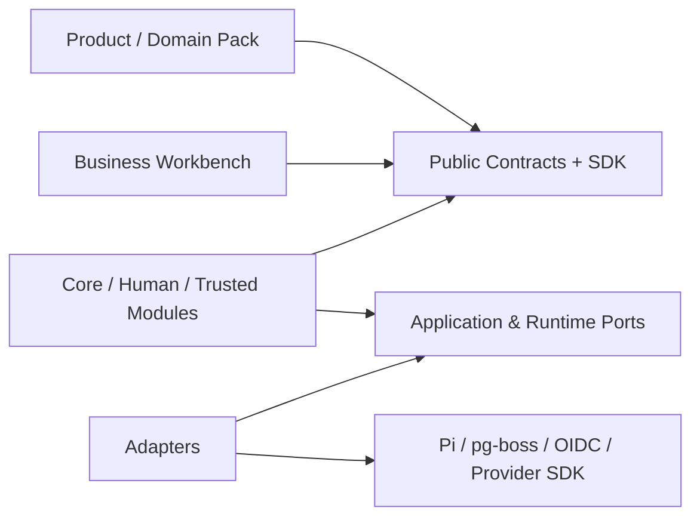
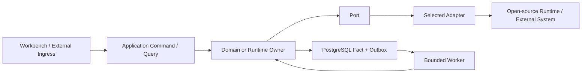
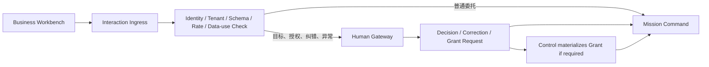

# ABH 与 Lime Ads 系统边界及技术基线

> 状态：Normative architecture and runtime-profile baseline
>
> 实现放行：可用于下游 D2 详细设计和 M0 契约骨架；机器状态、执行、错误、NFR 与 Contract Package 未形成并通过一致性 CI 前，不放行生产写入
>
> 适用范围：全部服务、Worker、Web 应用和 Adapter
>
> 上位框架：[Agentic Business Harness 总体设计](Agentic-Business-Harness总体设计.md)
>
> 领域与产品：[Marketing Domain Pack 规范与 Lime Ads 总体设计](https://github.com/GoatGit/lime-ads/blob/main/docs/V1/00-%E6%80%BB%E4%BD%93%E8%AE%BE%E8%AE%A1/%E4%B8%AD%E5%9B%BD%E5%87%BA%E6%B5%B7AI%E5%B9%BF%E5%91%8A%E8%90%A5%E9%94%80%E7%B3%BB%E7%BB%9F%E6%80%BB%E4%BD%93%E8%AE%BE%E8%AE%A1.md)
>
> 版本：2.12
>
> 日期：2026-09-07
>
> 开源基线：ABH 代码、规范、SDK、CTK 与示例采用 Apache-2.0；论文采用 CC BY 4.0

## 1. 设计目标

Lime Ads 以 Agentic Core 为默认生产中心，以 Trusted Runtime 保证确定性控制和可靠执行，通过 Human Gateway 接入人类责任，并由 Business Workbench 提供面向品牌、代理商和治理人员的业务体验。

四个子系统实现 Agentic Business Harness；Marketing Domain Pack 注入六类营销 Agent、营销对象、Manager 模板、Workflow、Policy、评测与业务投影；媒体与经营 Connector Pack 隔离外部平台协议。Learning Plane 是横切能力，由四个子系统共同实现，不创建第五个可绕过原边界的控制中心。

技术设计需要同时满足：

- Agent 能持续规划、行动、验证和学习；
- 广告账户、预算、数据和外部写入受确定性控制；
- 长周期任务可以暂停、恢复、取消和对账；
- 品牌与代理商保持独立 Organization，通过 Workspace 授权协作；
- AI 运行细节不成为普通用户的操作负担；
- 模型、Pi Agent、媒体平台和存储实现可以替换，不改变领域语义。
- Result、人类纠错、异常和运行事故能够形成受治理 Learning Signal，并经独立评测、最小 Scope 发布和回滚转化为 Knowledge 或系统能力。
- 第三方可以只使用公开源码、公开制品和本地基础设施安装、运行、扩展和验证 ABH。
- ABH Core 保持领域中立；营销语义只存在 Marketing Domain Pack 与 Lime Ads 产品层。

## 2. 四个核心子系统

| 子系统 | 负责 | 不持有的责任 |
|---|---|---|
| Agentic Core | Mission 规划、Agent 推理、专业协作、Workflow、Run、上下文、验证与能力学习编排 | 最终权限判断、领域 Knowledge 迁移、凭据、外部写入可靠性和人类批准 |
| Trusted Runtime | 身份、租户、Mandatory Control Policy、限额/配额、能力允许范围、事实提交底座、工具执行、对账、审计与恢复 | 营销策略、创意语义、经营解释和各领域聚合的业务状态所有权 |
| Human Gateway | 将目标、授权、纠错和异常解析为正式责任事件，找到有权 Manager 并保存决定 | 日常营销生产和外部动作执行 |
| Business Workbench | 按场景呈现目标、进展、结果、风险、待办和授权，采集用户输入 | Agent 编排、权限裁决和媒体 API 调用 |

四者是逻辑责任边界，不预设四套独立服务。M0 采用内置 Worker 的模块化单体，M1 真实写入才拆一个独立 Worker；只有独立伸缩、故障隔离、数据驻留或团队所有权形成明确需要时才进一步拆成服务。

ABH 产品语汇中，`Manager` 专指承担正式业务责任的人类交互概念。系统组件统一使用 `Controller`、`Service`、`Engine`、`Resolver` 或 `Registry`，避免使用 `Operation Manager` 之类名称混淆人类责任与机器控制。第三方产品类别名称如 Secret Manager 不在此限制内。

Learning Plane 的控制权分布如下：Agentic Core 内的 Evaluation & Learning 拥有 Learning Signal/Case、Capability Candidate 和 Gate Artifact，并向 Domain Knowledge Owner 提交 Knowledge Candidate Command；Domain Knowledge Owner 提交 Knowledge 生命周期；Trusted Runtime 的 Capability Release Controller 拥有行为版本组合、Shadow/Canary Assignment、发布、暂停和回滚，Data Plane 保存血缘；Human Gateway 记录人工 Signal 并路由高风险发布责任；Business Workbench 提供纠错、能力版本、学习依据和撤回用途的业务界面。Producer Agent、Evaluator 和 Release Authority 使用不同审计身份。Capability Registry 仅解析 Tool、Model、Connector、Adapter 等运行能力的版本、兼容性和健康，不承载学习发布。

## 3. 技术基线

约束按责任域裁决，而不是让一份文档覆盖全部内容：ABH 总体设计定义架构不变量与增强门禁；本文定义唯一运行 Profile；Lime Ads 总体设计定义营销语义；下游状态/执行/NFR 规范必须定义对应机器契约；首条工程路线只选择切片。下位文档不得改写上位责任域；若 Profile、机器契约、发行锁文件或模块要求仍无法唯一裁决，构建与发布失败，必须修正规范，不能拼接两套要求。

本章区分四类约束，避免“支持某 Adapter”被误读为“首期必须部署该服务”：

1. **固定代码与契约基线**：所有适用 Profile 都必须遵守的能力语义与 Port；
2. **阶段部署 Profile**：进入该阶段必须部署的最小实现；
3. **条件式 Adapter**：能力或量化门禁成立才启用，并可经同一 Port 替换；
4. **未来演进候选**：出现门禁证据前不得进入当前依赖或部署清单，证据成立后才按条件式 Adapter 管理。

### 3.1 固定代码与契约基线

| 项目 | 固定基线 |
|---|---|
| 服务端 | Node.js 24 LTS、TypeScript `strict`、ESM；精确补丁版本锁定 |
| HTTP / 数据访问 / 迁移 | Fastify 5；postgres.js 经 Repository/UoW；node-pg-migrate 承载迁移历史，Pack Runner 负责权限、计划与验证 |
| 模型与 Agent | 工具循环固定走 `AgentRuntimePort → PiAgentRuntimeAdapter → ModelInvocationPort → Model Gateway → Model Adapter`；无工具任务走 `Structured Model Job → ModelInvocationPort → Model Gateway → Model Adapter`。Pi 参考版本为 `@earendil-works/pi-agent-core@0.85.1`，类型适配用 pi-ai 同步锁版；以 ABH 第 13 章映射和 CTK 为放行依据 |
| 正式数据 | PostgreSQL 16 是状态、Ledger、Outbox、关系事实和 Audit Record/Metadata 的唯一来源；pgvector 按检索需要启用 |
| 授权 | PostgreSQL 保存 Membership/Assignment/Delegation/Grant 及 MissionAuthority/ExecutionAuthority；确定性校验与进程内 OPA-WASM 形成统一 Resolver；Mandatory Control Policy 与 Domain Behavior Policy 独立版本化 |
| 事件 | PostgreSQL Transactional Outbox；消费者必须具备 Inbox、幂等和可恢复水位线 |
| 持久工作 | 只依赖 `DurableExecutionPort`；M0 采用精确锁版的开源 `pg-boss` Adapter，业务代码不得依赖具体队列/编排 SDK，也不得自研通用队列 |
| Tool | 同进程优先用强类型 Binding；跨进程协议只经 `ToolProtocolPort`，Tool Call 始终重入 Tool Gateway |
| Secret / Artifact / Identity | 分别只经 `SecretBrokerPort`、`ObjectStorePort`、`IdentityProviderPort`；业务类型不泄漏供应商 SDK |
| 可观测性 | OpenTelemetry SDK + 结构化 stdout；Trace/Metric/Log 与 Audit 分离 |
| 能力发布 | ABH Capability Release Controller + PostgreSQL 是唯一发布 Owner；以 Run/Action 为主体持久固定 pinSet，Plan 编译与恢复复用该集合 |
| Pack 运行 | Pack Loader 拥有 Installed Pack 生命周期；Capability Release Controller 拥有行为版本组合与 Scope Assignment；Capability Registry 只解析能力版本、兼容性和健康 |
| Web | Next.js + React + TanStack Query；JSON Forms 仅用于责任表单，ECharts 仅读取业务 Projection |
| 契约 | JSON Schema 2020-12 + Ajv 8；json-schema-to-typescript 生成 TS，OpenAPI 3.1 引用同源 Schema；状态 Registry 生成枚举、迁移表和数据库 CHECK，详见 [Contract Package](../10-ABH详细设计/05-Contract-Package与一致性检查.md) |
| 工程 | pnpm Workspaces + Turborepo、Prettier、ESLint Flat Config、Vitest、Playwright、Changesets |
| 时间 / 金额 / 标识 | UTC 持久化并保留业务时区；Money 使用 ISO 4217 `currency` 与主货币单位十进制字符串 `amount`，数据库使用精确定点类型；ID 由服务端生成且外部 ID 分列 |

表中选型约束对应能力的实现；部署仅装配已启用能力。独立 Action 无需 Pi、模型、Mission、学习或 Web；需要 ABH 原生 Agent 时才启用相应链路。公开接入统一见 [SDK 设计](../10-ABH详细设计/60-SDK与CTK详细设计.md)，能力配置与依赖编译见 [CLI 设计](../10-ABH详细设计/61-CLI-Distribution与运维详细设计.md)。

fast-check、Testcontainers、StrykerJS、Jazzer.js、API Extractor、TypeDoc、Docusaurus、markdownlint-cli2、Lychee、Syft、Cosign、CodeQL、OSV-Scanner、Gitleaks、Trivy、ScanCode Toolkit 与 ORT 是按风险和发布类型启用的工程工具，不是常驻运行服务，也不要求每个 M0 提交同时运行全套工具。安全关键 Package、公开 SDK 和正式发行仍须满足第 11.3 节对应门禁。

Money 的精度、规范化与舍入方式由 Contract Package 按字段固定；媒体微单位、汇率和未结消耗保留计算精度，展示或结算时才按相应规则舍入。Provider 的最小单位整数在 Adapter 边界转换并保留原值/单位；汇率以十进制字符串记录方向与版本。JSON Number/二进制浮点不得承载金额或汇率，跨币种相加必须经过带血缘的换算。

### 3.2 唯一阶段部署 Profile

| Profile | 必需部署 | 条件式部署 | 明确不因阶段自动引入 |
|---|---|---|---|
| M0 契约与模拟 | `abh-server`（内置有界 Worker）、PostgreSQL | Workbench 启用时增加 `abh-web`；若使用外部模型，启用仅限非生产的 SecretBroker Adapter；测试 Identity、模拟 Connector 和开发 Secret Adapter 均在生产 Profile 启动失败 | 独立 Worker、Temporal、MCP Server、生产 IdP/Secret Manager、Object Store、消息中间件、独立缓存 |
| M1 单领域可信写入 | M0 + 独立 `abh-worker` + 生产 OIDC + `SecretBrokerPort` 实现 | 有文件/大对象才加 Object Store；复杂持久等待门禁成立才加 Temporal；生产值守才加 Metrics Backend | Kafka、Valkey、OpenFGA、OPA Server、SPIRE、独立 Trace/ML 平台 |
| M2 受限经营 | 沿用通过验收的 M1 Profile | 只按已观测容量、隔离或合规证据增加 | 不因预算、实验或 Agent 数量直接增加基础设施 |
| M3 规模与学习 | 沿用上一阶段并逐项评审 | 仅按 ABH 总体设计第 18.4 节增强门禁引入 | 不提供“全家桶”默认 Profile |

M0 的唯一必需外部状态服务是 PostgreSQL；持久 Job 复用同库上的 `pg-boss`，它是库依赖而非第二个状态服务。M1 的生产 OIDC 和 Secret 能力可以复用部署方现有服务；需要自托管时，参考 Adapter 分别为 Keycloak 和 OpenBao。需要对象存储时参考 SeaweedFS（S3 API）；需要复杂持久编排时整体替换为 Temporal；需要生产指标后端时参考 Prometheus/Grafana。参考实现不是第二 Owner，也不是无条件安装要求。

`distribution/components.lock.yaml` 记录**某一已发布 Profile 实际包含**的版本、镜像摘要、SPDX 许可证和供应链属性；`distribution/compatibility.yaml` 记录 Core、CLI、Pack、Adapter、Extension 与 Profile 的可用组合。它们不得把未过门禁的条件式组件反向升级为固定基线。Pi Agent 当前为 `0.x`；升级必须通过类型检查、契约测试和离线评测；只有启用了 Temporal 或 Canary 的 Profile 才分别要求 Workflow Replay 或 Canary 证据。

官方发行版默认关闭项目遥测，禁止远程许可检查和私有 SaaS 必选依赖。模型或 Connector 网络访问必须来自显式配置、数据用途和出口 Policy。开源发行版不包含闭源或需额外商业授权的内容；实际许可证、镜像摘要和来源以当前 Profile 的锁定清单与扫描证据为准。

V1 不并行采用 LangGraph、OpenAI Agents SDK、CrewAI、Flowable Runtime、Dapr、Backstage Runtime、React Admin 或 Apache Superset。组件选型遵循 [ABH 第 4.5 节](Agentic-Business-Harness总体设计.md#45-abh-自研边界)的开源优先、薄适配与补缺退出规则；当前具名基线是本次交付的确定选择，业务契约与组件实现分别演进。现有实现缺少必要能力，或上游/替代组件经验证可降低总体维护成本时，通过既有 Port/公开接口替换，并同步迁移权威状态、退出旧实现；同一业务链不并行建立第二状态、调度、授权或 UI Owner。已有运行排空或按安全恢复协议迁移，不要求一次部署切换所有历史实例。

组件版本与许可进入既有锁文件；自研补缺的合同缺口、上游 Issue/PR、替换条件及维护责任在对应模块实现记录中维护。每批验收复核本批涉及的补缺，满足替换条件后删除重复机制。此规则不新增组件注册服务，也不要求提前实现多个候选 Adapter。商业托管服务保持显式可选，公开 Core CTK 和开发闭环继续独立可运行。

## 4. 强制依赖方向

**编译时依赖**与**运行时调用**分开表达，避免把“Adapter 实现 Port”误读为“Port 依赖 Adapter”。



公共依赖图只允许图中方向。Product、Pack 和 Web 不得导入 Core Internal、数据库 Row 或 Provider/Pi 原生类型。



强制规则：

1. 领域模块只依赖 Port、领域类型和应用契约；
2. 只有 Pi Adapter 模块可以导入 `@earendil-works/pi-agent-core`；旧命名空间包不进入新发行依赖；
3. 只有启用的 Temporal Adapter 可以导入 Temporal SDK；任何 Durable Job/Workflow/Activity 只能调用 Application Port，不直接写领域 Repository；
4. 只有启用的 MCP Adapter/Server 可以导入 MCP SDK；同进程 Binding 与 MCP Tool Call 都必须重新进入 Tool Gateway；
5. 业务模块、Workflow、HTTP Route、普通队列消费者和前端不得导入 `@earendil-works/pi-ai`、模型供应商 SDK、直接调用 Model Gateway 或 LLM HTTP API；需要工具循环的任务走 `AgentRuntimePort`，固定无工具模型任务以受限 Structured Model Job 走 `ModelInvocationPort`。Pi Adapter 只用 pi-ai 做类型/事件映射，其供应商传输仍由 Model Adapter 拥有；
6. Pi Agent 使用的工具全部由 ABH Tool Binding Factory 按当前授权生成；Marketing Domain Pack 只注册营销 Tool Schema 与 Capability；
7. 外部系统写入只能进入 Trusted Runtime 的 Action Engine；
8. Repository 在数据访问边界强制接收 Organization 或内部系统上下文，调用方不得临时拼出租户条件；
9. IdP、Policy Evaluator、Durable Execution Adapter 和评测工具的记录都只是身份输入、执行证据或评测制品，不能替代 ABH 正式对象；
10. Web 只能调用应用 API，不包含模型密钥、媒体 Token、Policy 规则或 Agent 系统 Prompt。

两条模型路径共用 `ModelInvocationPort` 之后的身份、数据用途、数据分类/驻留、供应商训练与保留条件、模型允许列表、费用、限流、可观测与审计控制。Pi Adapter 只拥有工具循环和 Agent Harness 适配，不拥有供应商选择、凭据或模型调用事实；Model Gateway 是模型路由与调用治理的唯一入口，Model Adapter 才可导入供应商 SDK。任何约束无法被当前 Route 满足时必须拒绝调用，不能把受限数据静默发往其他模型。

依赖约束应由 workspace lint、依赖图测试和代码所有权共同强制，而不是只写在文档中。

数据库隔离从 M0 开始按 [Data 的 RLS/UoW 合同](../10-ABH详细设计/28-Data-Artifact与Audit详细设计.md#11-数据库角色与-rls)实现：Tenant 表 ENABLE/FORCE RLS，普通 runtime 角色无所有权/超级用户/BYPASSRLS，单事务固定一个 resourceOrganizationId。跨组织责任核验和全局调度使用受限函数，业务 Owner 仍共享同一事务；连接池不得保留会话级租户设置。迁移/维护凭据不进入普通应用进程。

## 5. 可信入口

Business Workbench 的普通委托和 Human Gateway 的正式责任输入都先进入统一的可信入口：



可信入口只完成确定性校验和路由，不理解营销策略。普通委托无需变成人类审批，但必须有合法身份、Organization、Workspace、数据用途和输入大小边界。

## 6. 状态与事实来源

- PostgreSQL Data Plane 中经对应状态 Owner 提交的持久记录是内部正式事实；Data Plane 负责通用事务、隔离、版本与血缘，不代替 Domain/Runtime Owner 决定业务迁移；
- 缓存、搜索索引和前端 Projection 可由正式事实重建；Pi Transcript、实际模型上下文、Trace 和 Workflow History 是按恢复/诊断策略保留的运行记录，不假定丢失后可以精确再现；
- Mission Controller 和 Run Orchestrator 只能通过带版本条件的 Command 修改正式状态；
- 外部媒体平台是其平台对象的事实来源，Lime Ads 通过映射与 Reconciliation 保存已核实副本；
- Trace 用于诊断，Audit 用于责任与合规，两者不能替代业务状态；
- 事件流用于传播已提交事实，不能用异步事件绕过同步授权检查。

## 7. 控制权顺序

| 控制主体 | 唯一控制权 |
|---|---|
| Mission Controller | Mission 生命周期、唤醒条件和发起 Run 创建/唤醒的唯一资格 |
| Run Orchestrator | 接收 Mission Controller 的 Command，唯一提交 Run 创建、启动快照、Task Graph、Checkpoint、暂停恢复和取消传播 |
| Coordinating Agent | 在 Domain Pack 声明的责任内提出计划、委托、优先级和 Task Graph Patch；不创建 Run 或提交 Graph |
| Task Agent | 在 Agent Task Contract 内形成领域产物、判断或 Proposed Action |
| Trusted Runtime | 身份、授权、限额/配额、能力、外部执行和持久化硬约束 |
| Human Gateway | 人类责任解析、Decision 路由和正式决定采集 |
| Domain Knowledge Owner | Knowledge Candidate 与 Knowledge 生命周期；只接受带 Evidence/Gate 的 Command |
| Evaluation & Learning | Learning Signal、Case、Capability Candidate 和评测编排；可提交 Knowledge Candidate Command 和 Gate Artifact，不创建、分配或发布 Capability Release |
| Capability Registry | Tool、Model、Connector、Adapter 等运行能力的版本、兼容性与健康解析 |
| Capability Release Controller | Agent/Prompt/Workflow/Tool/Domain Behavior Policy/Model Route 版本组合、Shadow/Canary 分配、暂停与回滚 |
| Control Policy Owner | Mandatory Control Policy 的版本、安全发布、生效和紧急收紧；不受 Capability Canary 覆盖 |
| Autonomy Controller | 依据授权、风险与能力证据计算有效 L0—L4 范围并执行降级 |

Agent 的输出是提案、结构化产物或工具请求。只有确定性控制器能够提交状态迁移；只有 Trusted Runtime 能执行外部副作用。

生产 Agent 可以提出 Memory、Task Graph 和有 TTL 的 Knowledge 更新，由各自 Owner 验证并提交；生产行为资产变更走独立评测和受控发布，强制策略走安全发布，评测配置走独立评测治理。具体协议统一引用 ABH 第 11 章。模型权重、权限、Domain Schema 和可执行代码均不可由 Agent 在线直接修改。

Capability 与授权顺序、两类 Policy、Scope 优先级和 Canary 分配统一遵循 [ABH 第 8.1 节](Agentic-Business-Harness总体设计.md#81-可信执行链)。Run 启动时固定行为版本，后续 Task/Action 只重验已固定 Assignment，不随新发布热换；当前 Mandatory Control Policy 和撤权始终实时适用。Authorization Resolver 唯一签发授权快照及 AuthorizedRequestContext，Action Engine 只负责 Action 状态提交。

## 8. 通用运行上下文

所有跨模块调用使用《通用应用契约与错误模型》定义的同一套可信字段，但 Envelope 按授权阶段明确分层：

1. 交互 Command/Query 和 Action Preflight 起点使用服务端生成的 `RequestContext`。它只证明已认证身份、组织/Workspace、Purpose、Epoch 和请求因果，不包含业务动作已授权的结论。
2. Authorization Resolver 必须针对具体 Task、Tool 或 Action Target 和对象版本执行 Preflight，生成该 Target 专属 Authorization Snapshot，才能签发 `AuthorizedRequestContext`。
3. Agent、Model、异步 Job 和 Tool Binding 只能使用与自身 Target 匹配的授权上下文。Proposed Action 携带上游快照引用作为来源证据，但必须从 `RequestContext + Action Target + upstream authority refs` 重新 Preflight，不得循环依赖尚未生成的 Action Snapshot。
4. 事件只保留同源 Actor/Tenant 字段与快照 Ref，不携带可被消费者当作新权限的可传播凭据。

字段只在 Contract Package 定义一次；相应下游规范及放行要求见[模块详细设计规范第 13 章](模块详细设计规范.md#13-下游工程规范与实现放行)：

```text
requestId / correlationId / causationId / traceId
actingOrganizationId / resourceOrganizationId / workspaceId
actor.type / actor.id / actor.responsibilityRef?
purposeOfUse / authnStrength / sessionEpoch / scopeEpoch
authorizationSnapshotId? / executionAuthorityRef? / originatingRequestRef?
contextExpiresAt
locale / businessTimezone
receivedAt
```

Mission/Run/Object/Expected Version 属于 Command Target、Agent Task 或版本 Ref，不加入第二套全局上下文。`authorizationSnapshotId` 在 `RequestContext` 中必须缺省，在 `AuthorizedRequestContext` 中必填。`actor.type` 区分 Human、AgentInvocation、Service 和 ExternalPlatform；Agent 使用独立 Invocation 身份，不能隐式继承发起用户的全部权限。长周期唤醒先以当前 Agent/Service Principal 生成新 `RequestContext`，再由 Authorization Resolver 基于当前 MissionAuthority/ExecutionAuthority、Grant、Mandatory/Behavior Policy、Epoch 与 Owner Version 针对目标签发短期 `AuthorizedRequestContext`。两类 Authority 的字段/来源遵循公共契约与 Control 设计；TenantContext 仅由受信 Context 派生，不能由调用方另行构造租户权限。

## 9. 失败原则

1. 权限、租户、数据用途和 Schema 校验失败时关闭路径；
2. 外部写入结果不明确时先对账，再决定重试；
3. 模型失败不能伪造业务成功；
4. 局部失败保留已确认状态，未确认结果保持显式未知；
5. Error Registry 按可重试、需重新规划、需人类责任和确定性拒绝等处置语义分类；如果错误、超时或进程中断后无法确认外部副作用，Operation Outcome 另行进入 `Unknown`，由 Reconciliation 收敛，`Unknown Outcome` 不作为错误分类；
6. 高风险依赖不可用时冻结新写入，确定性监控、预算熔断和对账继续运行；
7. 人工接管沿用相同权限、Action 和 Audit 契约。

### 9.1 初始 NFR 与容量验收包络

下表是 M1/M2 首次生产资格的设计目标，不是已实现事实。所有数字必须在固定硬件、数据规模、Provider Fake/真实沙箱和故障模型下形成可复现证据；真实负载校准只能在启用前收紧或经 ADR 调整，不能在测试失败后静默放宽。

| 类别 | 初始验收目标 | 失败时行为 |
|---|---|---|
| 普通 API | 不含模型/Provider 的 Command/Query 在参考负载下 p95 ≤ 200 ms、p99 ≤ 500 ms | 限流或返回显式过载，不跳过授权/版本校验 |
| 急停与撤权 | 急停受理 p95 ≤ 2 s；新 Operation Dispatch 阻断 p99 ≤ 5 s；已签发 Binding/Run 的撤权传播 p99 ≤ 30 s | 冻结新写入；已 Dispatch Operation 进入对账 |
| Action 可靠性 | Proposed/Authorized 提交与 Outbox 原子；已接收 Command 的重复外部副作用为 0；Unknown 在 Connector 规定窗口内收敛为确定结果或 Exception | 不盲重试，不把未回执标记成功 |
| Projection 新鲜度 | 每个读模型显示 `asOf/watermark/stale`；领域包在生产前冻结各数据类别的 p95 时限 | 超窗后读路径显示过期，停止依赖该数据的高影响决策 |
| 恢复目标 | 进程崩溃后已提交业务事实 RPO=0；单区域灾难下 Mission/Decision/Grant/Action/Operation/Result/Audit 的 RPO ≤ 5 min、核心控制与对账 RTO ≤ 60 min | 切只读或冻结写入，优先恢复 Control/Action/Reconciliation |
| 队列恢复 | 参考负载下积压恢复吞吐 ≥ 稳态到达率 2 倍；单 Connection/Organization 隔舱，积压不得饿死急停、撤权和对账 | 背压生成/回补任务，关键队列保留独立配额 |

初始 ABH 参考负载固定为：100 个活跃 Organization、1,000 个 Connection、100,000 个受管外部对象、每日 1,000,000 条归一化外部观察、100 个并发 Run、20 次/秒稳态且 50 次/秒持续 5 分钟的 Action Dispatch 峰值。该包络用于证明“模块化单体 + 独立 Worker + PostgreSQL”在首个生产范围内成立，不代表产品容量上限。超过包络先进行查询/索引、批处理、分区、隔舱和 Worker 扩容；只有 ABH 总体设计第 18.4 节的量化门禁成立才增加缓存、消息系统或拆服务。

Lime Ads 在通用包络上叠加营销专属验收：新 Spend Observation 提交后，超界 Scope 阻断新增/扩大 Spend Commitment 与 Dispatch 的 p99 ≤ 5 s；活跃媒体消耗/状态新鲜度 p95 ≤ 15 min；Commerce/CRM 经营数据 p95 ≤ 60 min。超窗时保留现有 Commitment 和尾差，冻结扩量及依赖过期数据的自动决策。这些领域数字不是 ABH Core 或其他 Domain Pack 的默认要求。

V1 采用单写区域与可恢复备份/备用环境，不做多主 Active-Active。每个 Connector 必须在生产启用前另行冻结 Provider 确认、暂停生效、数据延迟、限流和 Unknown 最大等待窗口；外部 SLO 与上述内部 SLO 分开报告，未收到平台确认时界面不得显示“已暂停”或“已成功”。

首次压测的参考配置为 API 4 vCPU/8 GiB、Worker 8 vCPU/16 GiB、PostgreSQL 8 vCPU/32 GiB 与 SSD，单区域内互联；冻结 30 天参考负载的数据，普通 API 使用 100 RPS、80% Query/20% Command、单请求上限 64 KiB，文件走独立上传路径。M1 先按实际单客户负载验收，再在扩大范围前验证上述完整包络；固定测试集要求下，规模 Profile 还需达到月度核心 API 可用性 99.9%。这些是容量假设，必须随运行证据记录实际硬件、索引和连接池配置。

Queue 以最老任务年龄和资源配额双重背压：普通生成/回补积压超过 30 min 时暂停接收同 Scope 新任务，超过 60 min 进入显式延期/拒绝；Control/撤权/对账使用保留配额，不能静默丢弃。Provider 故障时只保存有界状态与唤醒游标，恢复吞吐按平台实际限流计算；达到等待上限时转 Exception，不能通过无限重试维持“运行中”。

灾难恢复必须先冻结所有外部写入并提升恢复 Epoch，撤销旧 Worker 的 Dispatch 资格。按最后可信备份水位回查外部对象、近期 Receipt/花费和未决 Operation，重建幂等映射及未结 Commitment 后才逐 Connection 放行。RPO≤5 min 表示可能丢失这段内部记录；在完成回查前不承诺零重复副作用。没有足够外部查询能力的 Connection 保持冻结并转正式异常。单节点进程崩溃与区域灾难分别验收，不用前者 RPO=0 的结果代替后者。

## 10. 防止过度设计

- Run、Turn、Step、Event 和 Checkpoint 是运行记录，不升级为用户可见业务对象；
- Agent Definition、Tool Binding 和模型路由是 Agentic Core 内部配置，不进入产品主导航；
- Plane 是责任分区，不等于必须部署为独立微服务；
- 不为 Planner、Evaluator、Memory、Router 或 Tool 分别创建稳定业务 Agent；
- 不因框架存在 Session、Thread 或 Handoff 就复制同名领域对象；Mission 和 Run 已覆盖所需业务语义；
- 不将每次 LLM 输出、Trace Span 或流式 Delta 永久保存；按恢复、审计和评测需要最小化持久化。

## 11. 开源发行的强制工程边界

### 11.1 公共与领域包

| 范围 | 可依赖 | 禁止依赖 |
|---|---|---|
| `@abh/contracts` | 标准 Schema、Envelope 和通用类型 | 任何 Domain Pack、Adapter、Workbench 或供应商 SDK |
| `@abh/core` | `@abh/contracts` 和明示的 Port | Marketing/Procurement Pack、外部 SDK 和 `src/internal` 跨包导入 |
| `@abh/domain-sdk` | Contracts 和领域扩展类型 | Core 内部 Repository、Adapter 类型和直接外部写入 |
| `@abh/connector-sdk` | Action/Operation/Receipt 与 Connector Port | 领域决策、Grant 生成、Secret Material 暴露 |
| `@abh/adapter-sdk` | 通用 Runtime Port | 业务对象语义和正式状态 Owner |
| `@abh/workbench-sdk` | Projection/UI Extension Contract | 数据库、模型、Policy Engine 和外部平台直连 |

`@abh/contracts`、`@abh/core` 和四个 SDK 禁止包含营销领域词汇所表达的类型、路由、数据表、错误码或默认 Policy。Marketing Domain Pack 和 Procurement Domain Pack 必须作为同等外部扩展使用公开 SDK，不获得内部访问特权。

`@lime-ads/marketing-contracts` 拥有 Brand/Plan/Creative/Campaign/Experiment 等营销 Schema，`@lime-ads/marketing-pack` 拥有六类 Agent、营销 Workflow/Policy/Evaluation/Projection。`@abh/contracts` 与 `@abh/core` 不得为它们建立特殊分支。具体分层、Pack Trust Mode 和 Loader 以[ABH 公共内核与 Pack 运行规范](ABH公共内核与Pack运行规范.md)为准。

### 11.2 运行配置与可移植性

- `abh-core` 是无 Workbench 和无基础设施编排的嵌入发行版；
- `abh-full` 使用 Helm 提供当前已通过门禁的生产 Profile；条件式组件通过显式 values 启用，不存在全组件默认安装；
- `abh-dev` 使用 Docker Compose 提供本地环境、`hello-business` 和显式开发 Fake，在生产模式启动必须失败；
- `abh-dev` 只有在显式启用 `allowUnsignedLocalPacks` 时可加载标记为 `DevelopmentOnly` 的本地未签名 Pack；该 Pack 只能绑定 Fake/模拟 Connector，真实 Secret、网络出站与外部写入均被拒绝；
- 所有配置必须有 Schema、默认值、敏感级别、重启语义、版本和示例；未声明环境变量禁止影响行为；
- Organization 数据导出和新实例导入必须使用公开 Manifest/Schema，不依赖原部署的内部 ID 或 Secret；
- 用户自行配置的 S3、OIDC、Model 或其他 Port 实现，可经 Adapter CTK 声明 Community 符合；官方只承诺 Compatibility Matrix 中列出的组合，不以参考 Adapter 限制可替换性。

### 11.3 发布门禁

正式发布同时要求：Semantic Versioning 和 API 稳定标签正确，对已存在的 Stable 1.x 版本可验证 N/N-1/N-2 中实际可用的组合（初次 1.0 不伪造尚不存在的旧版本），公开 CTK 和 Distribution E2E 通过，Syft 生成 SPDX/CycloneDX SBOM，CodeQL、OSV-Scanner、Gitleaks、Trivy 和许可扫描无阻断项，制品具有 SLSA Provenance 和 Cosign 签名。没有任何私有门禁可被用于获得官方符合性声明。
